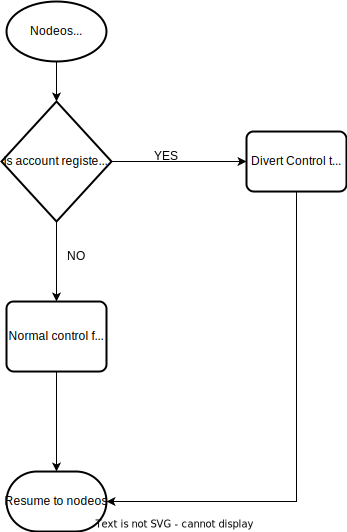

## Debug Environment
The goal of this project is to create a debug environment runner program and associated changes to `leap`.

### New tool `antler-run`
This "runner" will load a smart contract compiled to a native shared object or WASM.  The reason for compiling to a shared object is two-fold: allowing automatic usage of GDB/LLDB and being forward compatible with NatiVM in the future.

### `antler-run` Commands
- `--contract` -> smart contract shared object or WASM file to load
- `--test` -> optional test shared object to load (this will be defined in the Testing Environment portion)
- `--nodeos-url` -> the URL where `nodeos` is at
- `--nodeos-port` -> the port that `nodeos` is listening at
- `--call-action` -> calls an action on the smart contract
- `--register` -> register an account name to be debuggable through `nodeos`

### LEAP Debug Plugin
In `leap` a new "debug" plugin will be provided to allow a few things to occur:
- Control flow to divert from nodeos to the external debug runner for action invocations.
- Allow for registration of an account to divert control flow when calling against it.
- Allow for control flow to resume to normal.
- Fix time and control time of nodeos so that debugging doesn't impact time and testing can control time. (Through the use of `LD_PRELOAD`.)
- Expose the host functions as RPC endpoints.




#### gRPC Endpoints
```protobuf
syntax = "proto3";

package leap;

service debugger {
  rpc RegisterAccount(string) returns (int32) {}
  rpc ReturnControlFlow(string) returns (int32) {}
  rpc SetTime(int64) returns (int32) {}
  rpc GetTime(google.protobuf.Empty) returns (int64) {}
  rpc CallAction(string, string, bytes) returns (optional bytes) {}
  rpc CallHostFunction(int64, optional bytes) returns (optional bytes) {}
}
```

##### Register Account
This RPC endpoint will take a `LEAP` account name and register it for control flow diversion.  This will return a status code.
* 0 - success
* -1 - fail, already registered
* -2 - fail, invalid name
* -3 - fail, account not found

##### Return Control Flow
This RPC endpoint will take a `LEAP` account name and direct the system to return control flow back to nodeos. This will return a status code.
* 0 - success
* -1 - fail, not registered
* -2 - fail, invalid name
* -3 - fail, account not found

##### Set Time
This RPC endpoint will take a new timepoint and set the current time to that time. This will return a status code.
* 0 - success
* -1 - fail, time is not monotonic

##### Get Time
This RPC endpoint will get the current block timestamp from nodeos.

##### Call Action
This RPC endpoint will take a `LEAP` account name, a `LEAP` action name, and a payload for action data.  This will return either nothing or a result from the action.

##### Call Host Function
This RPC endpoint will take an identifier for which nodeos host function to call and a serialized payload.  This will return either nothing or a serialized result.

The identifier for the host functions will be given by a stable ordering such that ids don't change for a host function between version changes.

#### Fixing time in nodeos
We will leverage the `fc/mock_time.hpp` system for this 'fixing' of time.

### `CDT` Component
We will be extending the 'native' testing framework system within CDT to produce a shared object smart contract instead of an executable smart contract.
This will allow us to compile with debug symbols and O0 (-g) and leverage LLDB/GDB immediately, we will also be able to leverage LLVM's static and dynamic analysis tooling and things like Valgrind (some work will need to be done here, but for v2 would be ready).

### `antler-run`
This new program will house the client for the RPC mentioned above, it will load and run smart contracts and will facilitate debugging of smart contracts.

#### `antler-run` Client
`antler-run` should connect to the nodeos instance running the Debug Plugin and convert 'C' host function calls into their gRPC counterparts for the smart contracts to use.

A set of command line commands will be provided:
* --register : this will take a `LEAP` account and register this client and nodeos to divert on the account given.
* --load-contract : this will take a file path to a smart contract to load via the runner. This will be either a WASM smart contract or a shared object smart contract. The runner should dynamic detect which type of 'smart contract' it is loading
* --call-action : this will take an action name and a serialized payload for the action and execute it.
* --attach-lldb : this will do the required parts for lldb to connect to the shared object correctly.

#### Host Functions
These will be provided via `antler-run` as exported symbols so that the smart contract can use them.  These will wrap over the C function call and generate the serialized format needed for the RPC call.  These will block until the result is returned via the RPC call and return the deserialized result.

### LLDB in CDT
LLDB should be compiled into CDT and available as a binary from our software stack for use with `antler-run`.

#### LLDB Plugins
LLDB has an extensible module system with Python.  We will use this to create some new functionality for LLDB, one will be reading table data and the other will be calling actions from within LLDB.