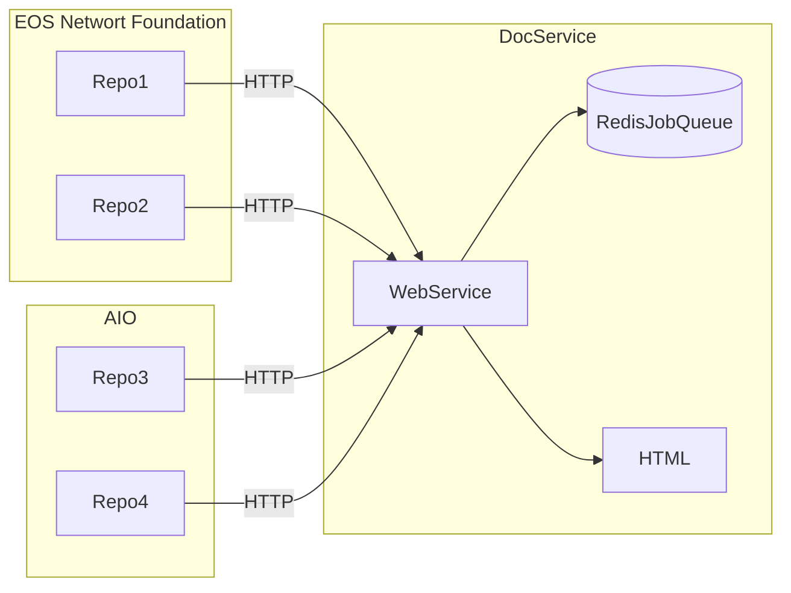

# Proposal: Kickoff Documentation Build on Git Actions

**Summary**: The purpose is to automate the update of documenation by integrating documenation builds with git actions. 
**Example**: Every pull request would trigger a git action, that would fire a URL to the documenation automation web service. The web service would then run a script to update the documenation. 

## Overview

One service will pull together documenation from various repos, process it, and assemble it into a single documenation portal. The portal currently processes documents into HTML, and uses various software packages to create HTML documents from code.
* MDX for Markdown
* Doxygen for C/C++
* Typedoc for Typescript
* Javadoc for Java
* OpenAPI for HTTP methods 

Documentation should be updated when there is a major update or a new release. In our organization, both of these action originate in *github*. This sets up a situation where many different repos need to come together into a coheasive, single documentation portal. This proposal lays out the following principles:
1. Git hub actions are the signal for document updates
2. There are many seperate repositories with documentation and code 
3. Teams own repos, and they decide which actions should update the documentation

## Architecture Overview

* Repos notify DocService via HTTP call
* DocService writes to job to stable queue
* DocService processes repo and creates HTML Documentation

## API
API is a HTTPS request. You can write your own script or utilize a market place script like [http-request-action](https://github.com/fjogeleit/http-request-action). 

### Required Parameters

### Optional Parameters

### Authentication

## Documentation Versions 

## Dependancies and PreConditions 

## Getting Status

## Long Running and Duplicate Requests

## Canceling Requests

## Deleting Documenation Versions
Not supported, currently no way to delete a specific version. This requires a manual intervention to delete a specific version of the documenation for a given repo. 
