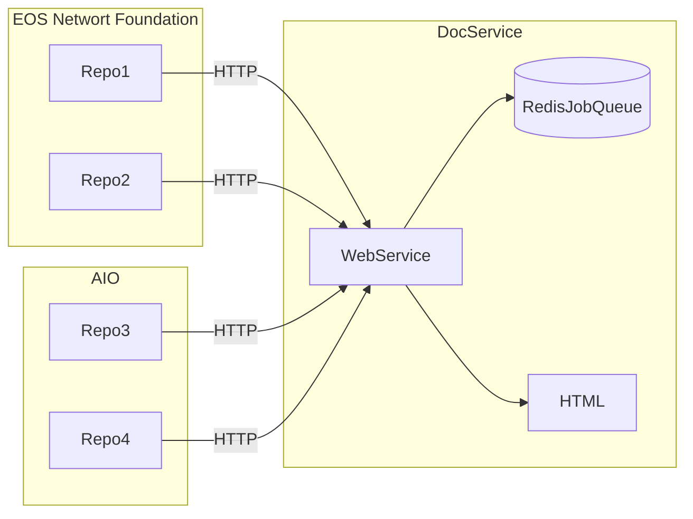

# Proposal: Kickoff Documentation Build on Git Actions

**Summary**: The purpose is to automate the update of documenation by integrating documenation builds with git actions. 
**Example**: Every pull request would trigger a git action, that would fire a URL to the documenation automation web service. The web service would then run a script to update the documenation. 

## Overview

One service will pull together documenation from various repos, process it, and assemble it into a single documenation portal. The portal currently processes documents into HTML, and uses various software packages to create HTML documents from code.
* MDX for Markdown
* Doxygen for C/C++
* Typedoc for Typescript
* Javadoc for Java
* OpenAPI for HTTP methods 

Documentation should be updated when there is a major update or a new release. In our organization, both of these action originate in *github*. This sets up a situation where many different repos need to come together into a coheasive, single documentation portal. This proposal lays out the following principles:
1. Git hub actions are the signal for document updates
2. There are many seperate repositories with documentation and code 
3. Teams own repos, and they decide which actions should update the documentation

## Architecture Overview


* Repos notify DocService via HTTP call
* DocService writes to job to stable queue
* DocService processes repo and creates HTML Documentation

## API
API is a HTTPS request. For github integration repo owners can write your own script or utilize a marketplace script like [http-request-action](https://github.com/fjogeleit/http-request-action). 

### URL Format and Overview

The url to trigger a documentation build. 
```
URL: http://docservice.eosnetwork.com/update/git-owner/git-repo
Action: POST
Authorization: [Basic <digest> | Bearer <token>] 
Body: [branch: value] [tag: value]
```
The values in the body are optional. When no branch or tag is specified the documentation service will default to `main`. The optional body values are space seperated. `branch:` and `tag:` are literal values. An example of a body would be:
```
branch: release5
```


### Required Arguments

The Authorization headers are required. Either form of authorization, `Basic` or `Bearer`, may be used. 

### Optional Arguments

The only optional values are passed in the body as space seperate name/value pairs. Branch and tag are used to checkout code from git repos. 
* No branch or tag provided
`git checkout`
* Branch provided no tag
`git checkout -b <branch>`
* Branch and tag 
`git checkout tags/<tag> -b <branch>`
* No Branch and tag. Puts local repo in detached HEAD state. Ok because it is read only.
`git checkout <tag>`

### Authorization

Authorization is done over HTTPS. The tokens and digests provided are not encrypted. Therefore the encryption provided by HTTPS is a must. Two different types of authentication are supported.
* Basic: a username and password are encoded together into a digest string. The HTTP client needs create the digest before making the call to the server.
* Bearer: an unmodified token is passed

Teams should manage their secretes appropriately. 

### HTTP Spec and Return Codes

Will be posted as documentation once the first release is ready.

## Documentation Versions 

## Dependancies and PreConditions 

## Getting Status

## Long Running and Duplicate Requests

## Canceling Requests

## Deleting Documenation Versions
Not supported, currently no way to delete a specific version. This requires a manual intervention to delete a specific version of the documenation for a given repo. 
