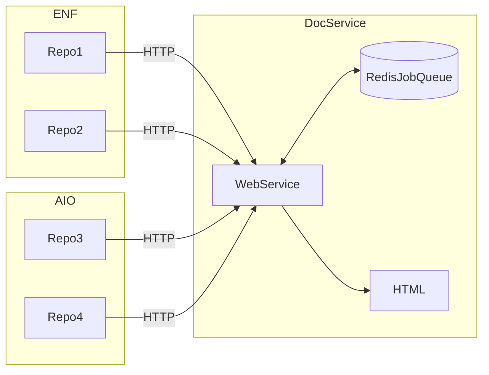

# Proposal: Kickoff Documentation Build on Git Actions

**Summary**: The purpose is to automate the update of documenation by integrating documenation builds with git actions. 
**Example**: Every pull request would trigger a git action, that would fire a URL to the documenation automation web service. The web service would then run a script to update the documenation. 

## Overview

One service will pull together documenation from various repos, process it, and assemble it into a single documenation portal. The portal currently processes documents into HTML, and uses various software packages to create HTML documents from code.
* MDX for Markdown
* Doxygen for C/C++
* Typedoc for Typescript
* Javadoc for Java
* OpenAPI for HTTP methods 

Documentation should be updated when there is a major update or a new release. In our organization, both of these action originate in *github*. This sets up a situation where many different repos need to come together into a coheasive, single documentation portal. This proposal lays out the following principles:
1. Git hub actions are the signal for document updates
2. There are many seperate repositories with documentation and code 
3. Teams own repos, and they decide which actions should update the documentation

## Architecture Overview


* Repos notify DocService via HTTP call
* DocService writes to job to stable queue
* DocService processes repo and creates HTML Documentation

## API
API is a HTTPS request. For github integration repo owners can write your own script or utilize a marketplace script like [http-request-action](https://github.com/fjogeleit/http-request-action). 

### URL Format and Overview

The url to trigger a documentation build. 
```
URL: http://docservice.eosnetwork.com/<action>/<git-owner>/<git-repo>/<version>
Action: POST
Authorization: [Basic <digest> | Bearer <token>] 
Body: [branch: <value>] [tag: <value>]
```

***Required***
The URL must contain all elements listed above, action, git-owner, git-repo, and version.
The Authorization header is required

**Optional**
The body values are optional

###Action##
* update - signal to document service to update documents
* cancel - cancel all jobs matching URL git-owner/git-repo/version
* token - generate a new bearer token
* status - list status of all jobs matching git-owner/git-repo/version

### URL Path
The following elements in the path are required
* action - tell the document server what to do
* git-owner - organization or person owning the repo
* git-repo - name of the repo
* version - version string that becomes a key to seperate documentation by major/minor version

**Example of URL**
```
http://docservice.eosnetwork.com/update/eosnetworkfoundation/mandel-swift/3.1
```

### Authorization

Authorization is done over HTTPS. The tokens and digests provided are not encrypted. Therefore the encryption provided by HTTPS is a must. Two different types of authentication are supported.
* Basic: a username and password are encoded together into a digest string. The HTTP client needs create the digest before making the call to the server.
* Bearer: an unmodified token is passed

Teams should manage their secretes appropriately. 

### Body Values
The values in the body are optional, and they are passed in the body as space seperate name/value pairs. Branch and tag are used to checkout code from git repos. 
* No branch or tag provided
`git checkout`
* Branch provided no tag
`git checkout -b <branch>`
* Branch and tag 
`git checkout tags/<tag> -b <branch>`
* No Branch and tag. Puts local repo in detached HEAD state. Ok because it is read only.
`git checkout <tag>`

### HTTP Spec and Return Codes

Will be posted as documentation once the first release is ready.

## Documentation Versions 

The documentation web site has a drop down allowing users to 

## Dependancies and PreConditions 

* [Documentation Version Support in Docusaurus](https://github.com/eosnetworkfoundation/devdocs/issues/7)
* AWS host with more memory (needs benchmark)
* [Restructure Documentation Service Code](https://github.com/eosnetworkfoundation/devdocs/issues/3)

## Getting Status

Status of the will be returned with the **status** action. The status is returned for all documents matching the git-owner, git-repo, and git-version. Status returns a json document with the following values
* request URL
* date put in job queue
* status - running or in-queue 
* running time - amount of time in running state

## Long Running and Duplicate Requests

This applies only to **update** actions.

Requests running more than 20 minutes will be canceled. This will leave the documents in an unknow state, and will require investigation by an adminsitrator.

Duplicte requests are for the same git-owner, git-repo, and git-version. The first requests in will be processed, all subsequent update requests will be removed. 

## Canceling Requests

Requests may be canceled by specifing the **cancel** action. All future requests matching the git-owner, git-repo, and git-version will be removed from the job queue. Any currently in progress document updates will continue untill completion, and will update the documentation web site. 

Canceling in progress leads to an undefined state. 

## Deleting Documenation Versions
Not supported, currently no way to delete a specific version. This requires a manual intervention to delete a specific version of the documenation for a given repo. 
