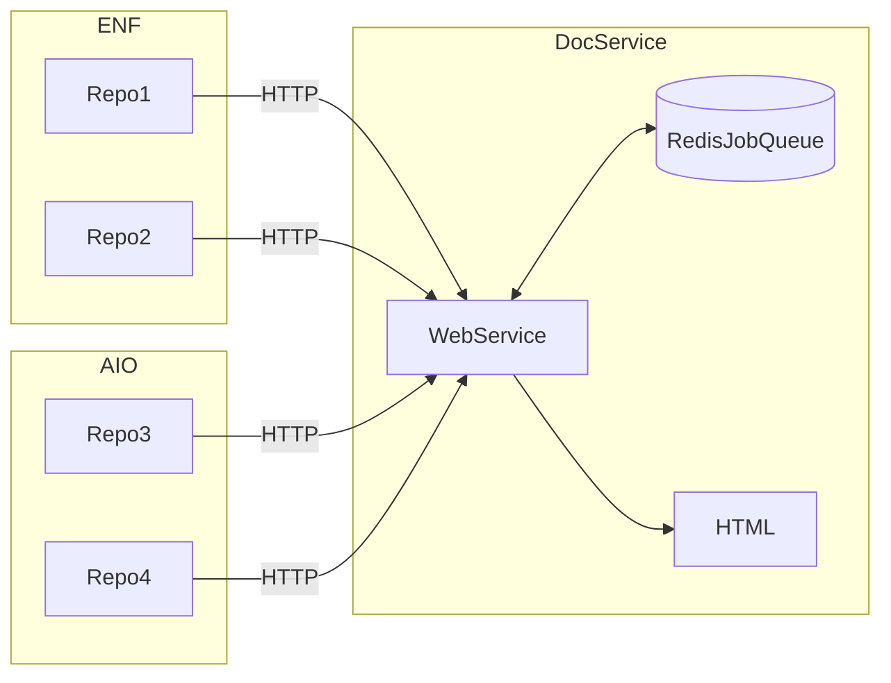

# Proposal: Kickoff Documentation Build on Git Actions

**Summary**: Proposal to automate the update of developer documentation by integrating documentation builds with git actions. 
**Example**: Every pull request would trigger a git action that would fire a URL to the documentation service. The service would then run a script to update the documentation sourced from that repository. 

## Overview

One service will pull together documentation from various repos, process it, and assemble it into a single documentation portal. The portal currently processes documents into HTML, and uses various software packages to create HTML documents from code.
* MDX for Markdown
* Doxygen for C/C++
* Typedoc for Typescript
* Javadoc for Java
* OpenAPI for HTTP methods 

Documentation should be updated when there is a major update or a new release. In our organization, both of these action originate in *github*. This proposal lays out the following principles:
1. Github actions are the signal for document updates
2. There are many separate repositories with documentation and code 
3. Teams own repos, and they decide which actions should update the developer documentation web site

## Architecture Overview


* Repos notify DocService via HTTP call
* DocService writes to job to stable queue
* DocService processes repo and creates HTML Documentation

## API
API is a HTTPS request. github repo owners can write their own script or utilize a marketplace script like [http-request-action](https://github.com/fjogeleit/http-request-action). 

### URL Format and Overview

The url to trigger a documentation build. 
```
URL: http://docservice.eosnetwork.com/<action>/<git-owner>/<git-repo>/<version>
Action: POST
Authorization: [Basic <digest> | Bearer <token>] 
Body: [branch: <value>] [tag: <value>]
```

**Example of URL**
```
http://docservice.eosnetwork.com/update/eosnetworkfoundation/mandel-swift/3.1
```

### Action
* update - signal to document service to update documents
* cancel - cancel all jobs matching URL git-owner/git-repo/version
* token - generate a new bearer token
* status - list status of all jobs matching git-owner/git-repo/version

`update` - requires the following
* authorization header
* git-owner in URL
* git-repo in URL
* git-version in URL

`update` - may include body values
```
URL: http://docservice.eosnetwork.com/update/<git-owner>/<git-repo>/<version>
Action: POST
Authorization: [Basic <digest> | Bearer <token>] 
Body: [branch: <value>] [tag: <value>]
```

`cancel` - requires the following
* authorization header
* git-owner in URL
* git-repo in URL
* git-version in URL

`cancel` - ignores body values
```
URL: http://docservice.eosnetwork.com/cancel/<git-owner>/<git-repo>/<version>
Action: POST
Authorization: [Basic <digest> | Bearer <token>] 
```

`token` - requires the following
* authorization header
* git-owner in URL

`token` - ignores body values
```
URL: http://docservice.eosnetwork.com/token/<git-owner>
Action: POST
Authorization: [Basic <digest> | Bearer <token>] 
```

`status` - requires the following
* authorization header
* git-owner in URL
* git-repo in URL
* git-version in URL

`status` - ignores body values
```
URL: http://docservice.eosnetwork.com/status/<git-owner>/<git-repo>/<version>
Action: POST
Authorization: [Basic <digest> | Bearer <token>] 
```

### Authorization

Authorization is done over HTTPS. The tokens and digests provided are not encrypted. Therefore the encryption provided by HTTPS is a must. Two different types of authentication are supported.
* Basic: a username and password are encoded together into a digest string. The HTTP client needs to create the digest before making the call to the server.
* Bearer: an unmodified token is passed

Teams should manage their secrets appropriately. 

### Body Values
The values in the body are optional, and they are passed in the body as space seperate name/value pairs. Branch and tag are used to checkout code from git repos. 
* No branch or tag provided
`git checkout`
* Branch provided no tag
`git checkout -b <branch>`
* Branch and tag 
`git checkout tags/<tag> -b <branch>`
* No Branch and tag. Puts local repo in detached HEAD state. Ok because it is read only.
`git checkout <tag>`

### HTTP Spec and Return Codes

Will be posted as documentation once the first release is ready.

## Documentation Versions 

The documentation web site has a drop down allowing users to select the relevant major and minor release.

## Dependencies and PreConditions 

* [Documentation Version Support in Docusaurus](https://github.com/eosnetworkfoundation/devdocs/issues/7)
* AWS host with more memory (needs benchmark)
* [Restructure Documentation Service Code](https://github.com/eosnetworkfoundation/devdocs/issues/3)

## Getting Status

Status of the will be returned with the **status** action. The status is returned for all documents matching the git-owner, git-repo, and git-version. Status returns a json document with the following values
* request URL
* date put in job queue
* status - running or in-queue 
* running time - amount of time in running state

## Long Running and Duplicate Requests

This applies only to **update** actions.

Requests running more than 20 minutes will be canceled. This will leave the documents in an unknown state, and will require investigation by an administrator.

Duplicate requests have the same git-owner, git-repo, and git-version. The first request will be processed, all subsequent requests will be removed. 

## Canceling Requests

Requests may be canceled by specifying the **cancel** action. All future requests matching the git-owner, git-repo, and git-version will be removed from the job queue. Any currently in progress document updates will continue until completion, and will update the documentation web site. 

Canceling in progress job results in an undefined state. 

## Deleting Documentation Versions
Not supported, currently no way to delete a specific version. This requires manual intervention to delete a specific version of the documentation for a given repo. 
