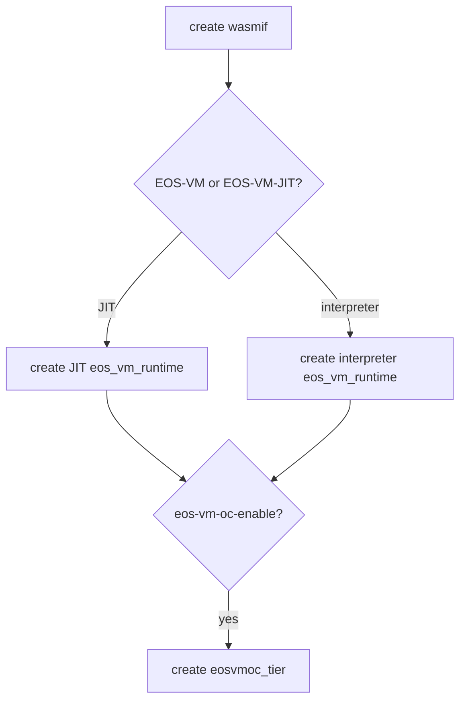
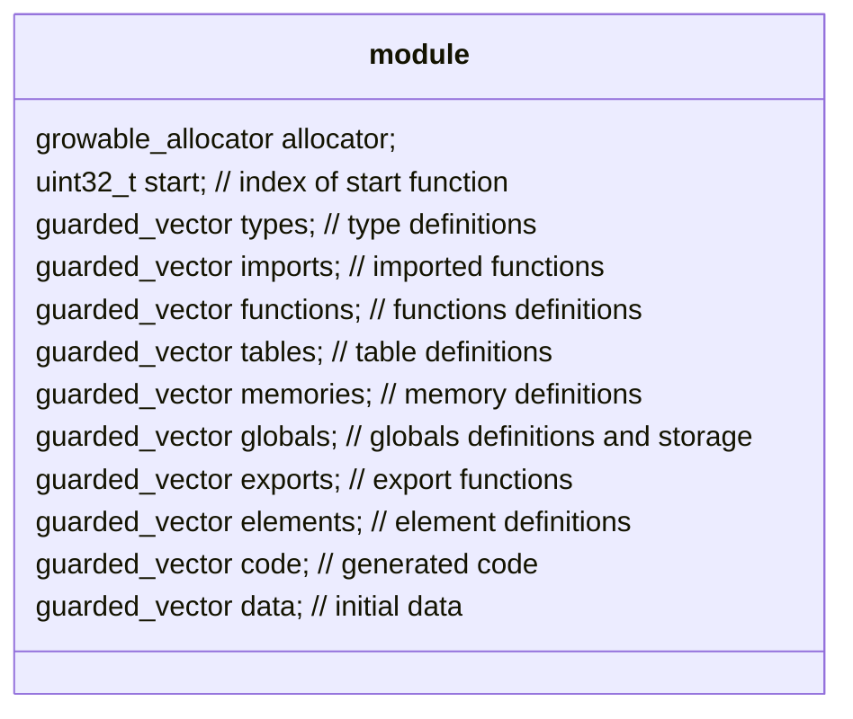
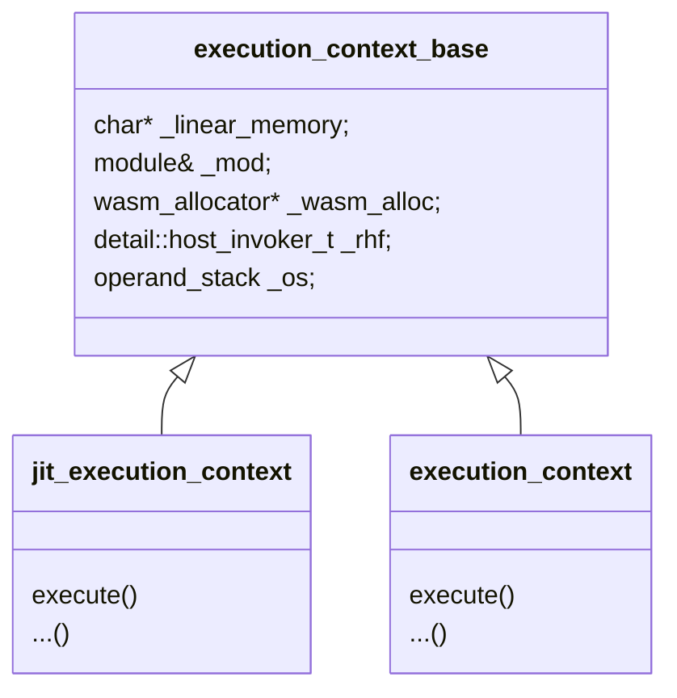
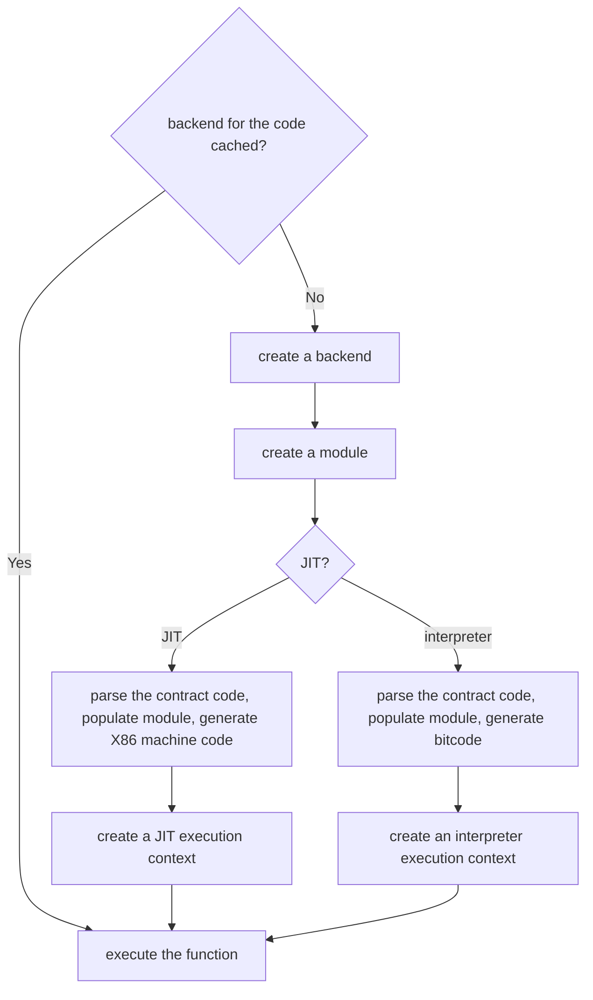
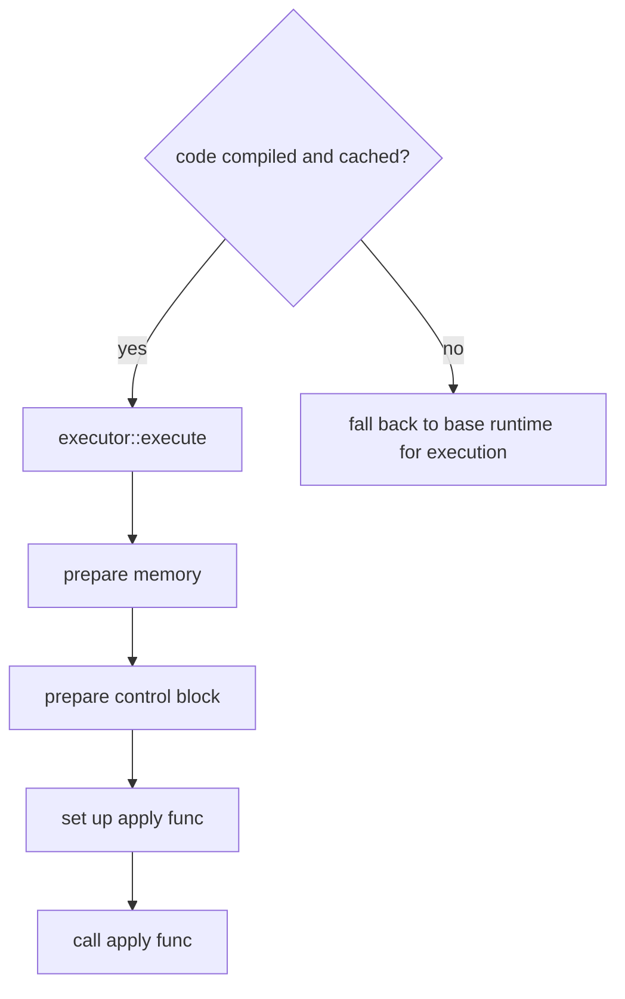
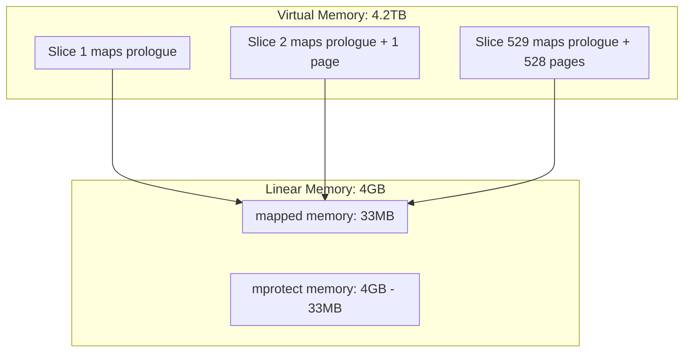
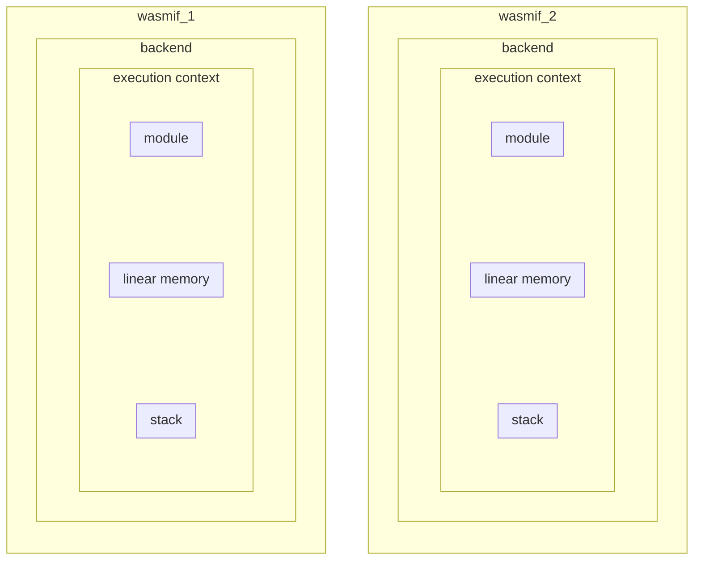
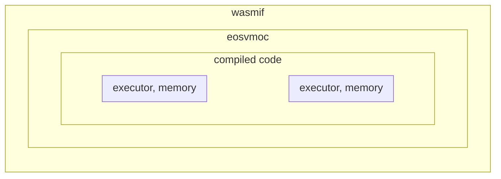
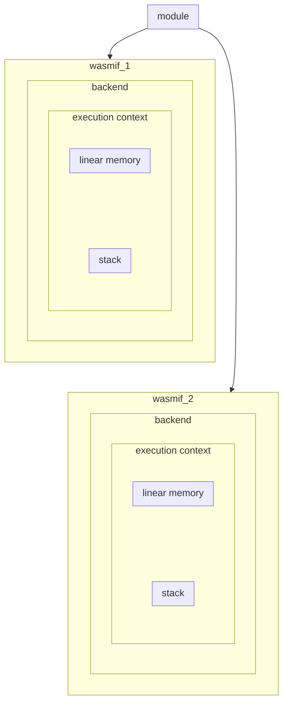

# Parallel Read-only Transaction Execution Improvements
Several improvement ideas related to WASM execution of parallel read-only trxs were identified: parsing contracts only once (https://github.com/AntelopeIO/leap/issues/800), reducing EOS-VM-OC memory slice count (https://github.com/AntelopeIO/leap/issues/645), and calculating virtual memory available to user space correctly (https://github.com/AntelopeIO/leap/issues/801).

This document describes the background and solutions.

## WASM Execution
A transaction execution goes through two major phases:
1. The smart contract of the transaction's actions are translated by CDT from C++ into WASM code.
2. The WASM is executed by an EOS VM.

`nodeos` supports three types of VMs for WASM execution: EOS-VM (interpreter), EOS-VM-JIT, and EOS-VM-OC.

At `nodeos` startup, resources required by WASM execution are created:
- a WAMS interface `wasmif`
- a `EOS-VM` or `EOS-VM-JIT` run time interface `eos_vm_runtime` (based on configuration option `--wasm-runtime`),
- and a `eosvmoc_tier` (when `--eos-vm-oc-enable` is configured). `eosvmoc_tier` contains `eosvmoc::executor`
and `eosvmoc::memory` used for execution. 



### EOS-VM and EOS-VM-JIT Execution

EOS-VM and EOS-VM-JIT execute similarly. Both involves module, execution context, and backend.

A module stores information about a parsed WASM code, consisting of WASM section definitions and generated bitcode or X86 machine code.


An execution context provides a runtime environment to execute a function (action). It instantiates a module by linking the module with
linear memory and stack, and initializing memory.


A backend encapsulates everything required for execution an action. The constructor of `backend` takes code,
host functions, allocator and options as input, constructs a parser, parses the code, and creates the execution context as an output.

Put together, given a contract WASM code and a function (action), `wasmif` executes the function in the following steps:



### EOS-VM-OC Execution
To improve the performance, EOS-VM-OC compiles and generates optimized code.

Given a contract WASM code and a function, `eosvmoc_tier` executes the function in the following steps:


#### Memory Slices

The description of this section is from https://github.com/AntelopeIO/leap/issues/645.

EOS-VM-OC uses a memory mirroring technique so that WASM linear memory can be both protected via page access permissions
and be resized without using `mprotect()`. EOS VM OC refers to these mirrors as "slices".

Prior to 2.1/3.1, Antelope's WASM memory could never exceed 33MiB. EOS-VM-OC would set up `33MiB/64KiB+1=529` slices each
with approximately `4GiB+33MiB` of virtual memory. This meant that EOS-VM-OC required approximately `529*(4GiB+33MiB)` of virtual memory;
about 2.1TiB.

In 2.1+/3.1+ Antelope technically (but Leap does not reliably) supports WASM memory up to full 4GiB (Leap's supported WASM limits 
are only those as defined in the reference contracts which remain 33MiB). EOS-VM-OC was modified so that any growth beyond 33MiB
is handled via `mprotect()`. This allows the optimization to remain in replace for all supported usages of Leap, while still allowing
Leap to technically support the full Antelope protocol which allows any size up to 4GiB. However, this support still required 
increasing the size of a slice to a full 8GiB of virtual memory, meaning that EOS VM OC now requires `529*8GiB` of virtual memory; about 4.2TiB.



## Parallel WASM Execution

### Parallel EOS-VM and EOS-VM-JIT Execution

To support transaction execution on multiple threads, a separate `wasmif` is created for each thread.
The runtime environments (compiled code and memory) are completely isolated from each other.



### Parallel EOS-VM-OC Execution
EOS-VM-OC was designed with multi-threaded support in mind. Only one `wasmif` is required. The same compiled code
can be used on multiple threads; each thread uses its own executor and memory.



## Issues

### Same Contract Parsed Multiple Times in EOS-VM and EOS-VM-JIT
In multi-threaded EOS-VM and EOS-VM-JIT execution, each thread requires a separate `wasmif`, which results in the same
contract parsed multiple times. Reuse of the parsed code will improve performance.

### Large Virtual Memory Required in EOS-VM-OC

EOS-VM-OC requires a separate memory for each executing thread. 
For example, if 16 parallel threads are allowed with the current strategy of requiring 529 slices per thread, 
that would require `16*4.2TiB` of virtual memory: more virtual memory than allowed on most processors. 
Future efforts, like sync calls and background memory scrubbing, will also increase the need for more active slice sets.

### Virtual Memory Available to User Space Not Calculated Accurately

To determine number of threads allowed for EOS-VM-OC, we need to know total virtual memory available to user space.
Currently we use `VmallocTotal` in `/prop/meminfo`. This is not accurate, as `VmallocTotal` reports virtual memory for kernel allocation;
kernel itself uses some of it.

## Proposed Solutions

### Compile Once for the Same Contract in EOS-VM and EOS-VM-JIT

To avoid parsing contract code multiple times, it is proposed the parsed module is shared by multiple execution contexts:


However, module stores global values (`current` in `global_variable`) in the globals section. This makes globals not thread-safe.

```
   struct init_expr {
      int8_t     opcode;
      expr_value value;
   };
   struct global_type {
      value_type content_type;
      bool       mutability;
   };
   struct global_variable {
      global_type type;
      init_expr   init;
      init_expr   current;
   };
```

In EOS-VM, `current` is modified by `set_global` in `eos-vm/include/eosio/vm/execution_context.hpp`
```
      inline void set_global(uint32_t index, const operand_stack_elem& el) {
      ...
      auto& gl = _mod.globals[index];
      ...
      visit(overloaded{ [&](const i32_const_t& i) {
         gl.current.value.i32 = i.data.ui;
         },
      ...
```
               
In EOS-VM-JIT, `current` is directly accessed in `eos-vm/include/eosio/vm/x86_64.hpp`
```
      void emit_set_global(uint32_t globalidx) {
         auto icount = fixed_size_instr(14);
         auto& gl = _mod.globals[globalidx];
         void *ptr = &gl.current.value;
         // popq %rcx
         emit_bytes(0x59);
         // movabsq $ptr, %rax
         emit_bytes(0x48, 0xb8);
         emit_operand_ptr(ptr);
         // movq %rcx, (%rax)
         emit_bytes(0x48, 0x89, 0x08);
      }
```

All other sections in module are thread-safe. The following table summarizes the thread safety:

| Section   | Description                                                                       | Thread Safe?|
|-----------|-----------------------------------------------------------------------------------|-------------|
| allocator | used only during parsing                                                          | yes         |
| start     | index of start function, shareable                                                | yes         |
| types     | type definitions, shareable                                                       | yes         |
| imports   | imported functions, shareable                                                     | yes         |
| functions | function definitions, shareable                                                   | yes         |
| tables    | table definitions, shareable                                                      | yes         |
| memories  | memory definition, shareable                                                      | yes         |
| globals   | globals definitions and storage                                                   | no          |
| exports   | exported functions, shareable                                                     | yes         |
| elements  | used to initialize tables, shareable                                              | yes         |
| code      | instructions, shareable                                                           | yes         |
| data      | initial data, shareable                                                           | yes         |

We plan to
- Move globals storage out from module and into linear memory
- Modify `set_global` and `get_global` in `execution_context.hpp`, `emit_get_global` and `emit_set_global` in `x86_64.hpp`.
- Cache parsed module per contract
- Cached module is removed from the cache when last block its code was used is before LIB and its linked execution context is not running.

### Reduce Memory Slice Counts
To conserve virtual memory to support more threads, We need to reduce the threshold where EOS VM OC transitions
from mirroring to `mprotect()`.

We plan to
- Gather memory usage from existing contracts.
  * Select most recent one year's EOS Mainnet snapshots and block logs.
  * Modify `eosvmoc::executor::execute()` to report `cb->current_linear_memory_pages` at the end of execution.
  * Replay the block logs.
  * Find max and 95 percentile of current_linear_memory_pages. This is to make sure vast majority of executions do not need using `mprotect`.
- Add a private compile option defining the threshold number of pages where the transition between the two approaches occurs.
  * In `chain/CMakefile`, set a Private variable `max_num_slices` and pass it to using `add_definitions` to C++ code.
  * Use `max_num_slices` to set up memory slices in `memory::memory()`.

### Calculate Virtual Memory Available to User Space Accurately
We plan to use `/proc/self/maps`, find the difference of addresses between `nodeos` program text and `vsyscall` and deduct the total
size of all memory segments.

A memory maps look like
```
560e88dc8000-560e88dcc000 rw-p 04dee000 103:03 20582300                  /home/lh/work/leap-4-0-vmoc-main-thread/build/bin/nodeos
560e88dcc000-560e88df7000 rw-p 00000000 00:00 0
560e8a03d000-560e8a107000 rw-p 00000000 00:00 0                          [heap]
...
7ffdceec3000-7ffdceee4000 rw-p 00000000 00:00 0                          [stack]
7ffdcefe2000-7ffdcefe6000 r--p 00000000 00:00 0                          [vvar]
7ffdcefe6000-7ffdcefe8000 r-xp 00000000 00:00 0                          [vdso]
ffffffffff600000-ffffffffff601000 --xp 00000000 00:00 0                  [vsyscall]
```

