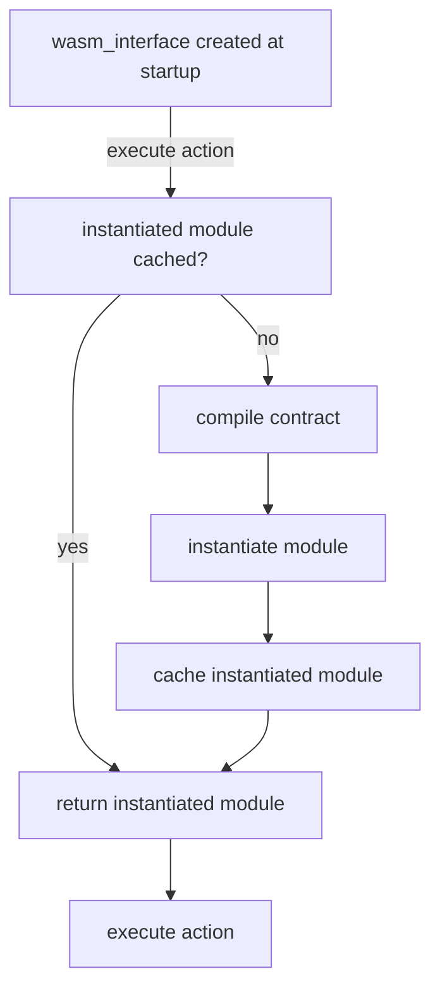
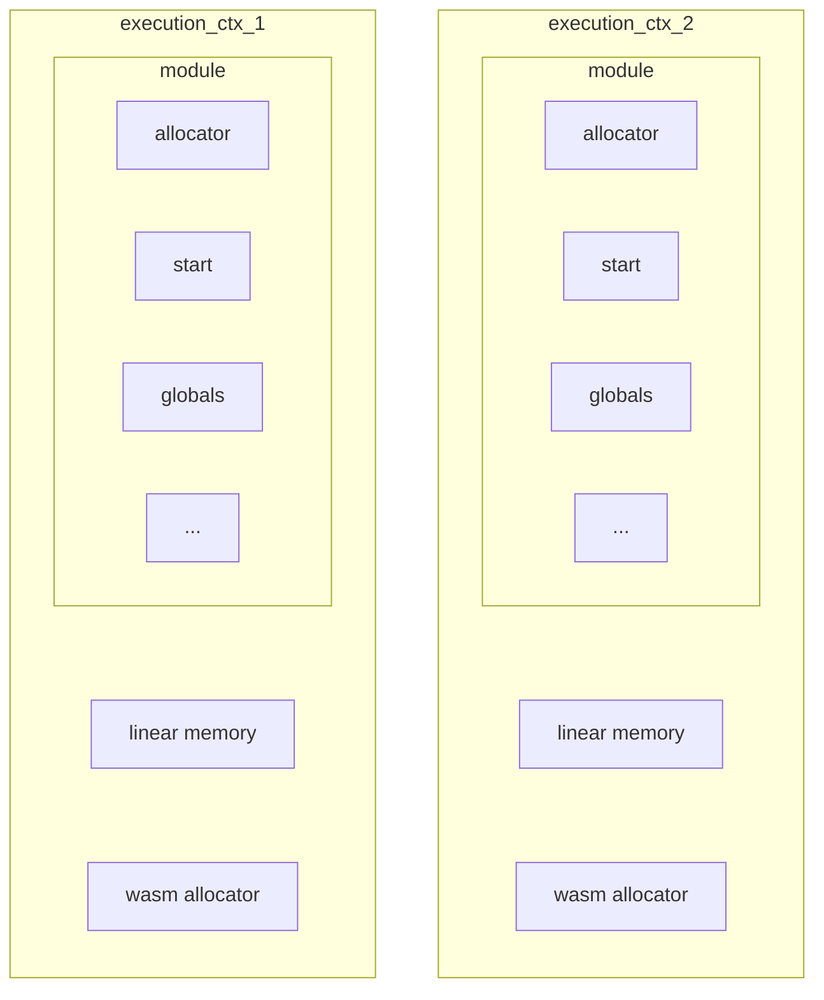

# Parallel Read-only Transaction Execution Improvements Proposal
Several improvements were identified for parallel read-only transaction execution. This document describes problem statements and proposed solutions.

## Compile Once for the Same Contract in EOS-VM and EOS-VM-JIT
### Background
https://github.com/AntelopeIO/leap/issues/800.

Currently, in multi-threaded `EOS-VM` and `EOS-VM-JIT` execution, a `wasm_interface` object is created for each read-only thread. 
If a contract is executed on multiple threads; the same contract is compiled multiple times by `wasm_interface` of the threads.

The control flow on a single thread execution



The excution contexts of multiple threads look like



In the current implementation of EOS-VM and EOS-VM-JIT, globals are part of module.
### Proposed Solution
Move globals out from module and into linear memory. `set_global` and `get_global` in execution_context.hpp need to be changed to point to the linear memory.
TBD: Do we need to protect `set_global` when called from multi-threads?

## Reduce EOS VM OC's memory slice count

### Background
https://github.com/AntelopeIO/leap/issues/645 

This section mostly comes from the Github issue description with editorial changes.

EOS VM OC uses a memory mirroring technique so that WASM linear memory can be both protected via page access permissions
and be resized without usage of mprotect(). EOS VM OC refers to these mirrors as "slices".

Prior to 2.1/3.1, Antelope's WASM memory could never exceed 33MiB. EOS VM OC would set up `33MiB/64KiB+1=529` slices each
with approximately `4GiB+33MiB` of virtual memory. This meant that EOS VM OC required approximately `529*(4GiB+33MiB)` of virtual memory; about 2.1TiB.

In 2.1+/3.1+ Antelope technically (but Leap does not reliably) supports WASM memory up to full 4GiB (Leap's supported WASM limits 
are only those as defined in the reference contracts which remain 33MiB). EOS VM OC was modified so that any growth beyond 33MiB
is handled via mprotect(). This allows the optimization to remain in replace for all supported usages of Leap, while still allowing
Leap to technically support the full Antelope protocol which allows any size up to 4GiB. However, this support still required 
increasing the size of a slice to a full 8GiB of virtual memory, meaning that EOS VM OC now requires `529*8GiB` of virtual memory; about 4.2TiB.

Executing parallel read only transactions via EOS VM OC requires a set of slices for each executing thread. 
If 16 parallel threads are allowed with the current strategy of requiring 529 slices per set, 
that would require `16*4.2TiB` of virtual memory: more virtual memory than allowed on most processors. 
Future efforts, like sync calls and background memory scrubbing, will also increase the need for more active slice sets.

We need to reduce the threshold where EOS VM OC transitions from mirroring to mprotect() to conserve virtual memory. 

### Proposed Solution
- Gather memory usage from existing contracts. TBD. From mainnet? How?
- Add a compile option (not "public" in cmake or such) defining the threshold number of pages where the transition between the two approaches occurs.

## Calculate Virtual Memory Available to User Space

### Background
https://github.com/AntelopeIO/leap/issues/801

After defining virtual memory required per thread, to determine number of threads allowed for EOS-VM-OC, we need to know
total virtual memory available to user space.

Currently we use `VmallocTotal` in `/prop/meminfo`. On a 5-level paging system, 
`VmallocTotal` might report 64PB but mmap() will not give access to the extended range unless providing a hint which we currently don't do.
In addition, `VmallocTotal` reports virtual memory for kernel allocation; kernel itself will use some of it.


### Proposed Solution
Approximately, we could use `/proc/self/maps`, find the difference of addresses between `nodeos` program text and `vsyscall` and deduct the total
size of all memory segments.

A memory maps look like
```
560e88dc8000-560e88dcc000 rw-p 04dee000 103:03 20582300                  /home/lh/work/leap-4-0-vmoc-main-thread/build/bin/nodeos
560e88dcc000-560e88df7000 rw-p 00000000 00:00 0
560e8a03d000-560e8a107000 rw-p 00000000 00:00 0                          [heap]
...
7ffdceec3000-7ffdceee4000 rw-p 00000000 00:00 0                          [stack]
7ffdcefe2000-7ffdcefe6000 r--p 00000000 00:00 0                          [vvar]
7ffdcefe6000-7ffdcefe8000 r-xp 00000000 00:00 0                          [vdso]
ffffffffff600000-ffffffffff601000 --xp 00000000 00:00 0                  [vsyscall]
```


