# Parallel Read-only Transaction Execution Improvements

During parallel read-only transaction implementation (https://github.com/eosnetworkfoundation/product/blob/main/transactions/read-only/parallel.md, https://github.com/AntelopeIO/leap/pull/776), several improvement ideas related to WASM execution were identified: parsing contracts only once (https://github.com/AntelopeIO/leap/issues/800), reducing EOS-VM-OC memory slice count (https://github.com/AntelopeIO/leap/issues/645), calculating virtual memory available to user space accurately (https://github.com/AntelopeIO/leap/issues/801), and falling back to parallel EOS-VM-Interpreter or EOS-VM-JIT execution if OC compiled
code is not available (https://github.com/AntelopeIO/leap/issues/1119).

This document describes the background and proposes design.

## Background

### WASM Execution
In Leap, smart contracts are written in C++. To execute a transaction, its contract code is first translated into WASM (WebAssembly)
by CDT; the WASM code is then executed on a VM.

Leap supports three types of VMs: EOS-VM-Interpreter, EOS-VM-JIT, and EOS-VM-OC.

#### Concepts

This section describes concepts necessary to understand WASM execution.

##### Module

Module is the fundamental unit of code in WASM. It consists of data and code definitions, representing executable form of a contract.
Given a WASM code, the EOS VM parser parses the code, generates bitcode for EOS-VM-Interpreter and X86 machine code for EOS-VM-JIT,
and stores the result in a module, as shown below.

A module object is created by WASM interface as a part of a backend before executing a transaction.

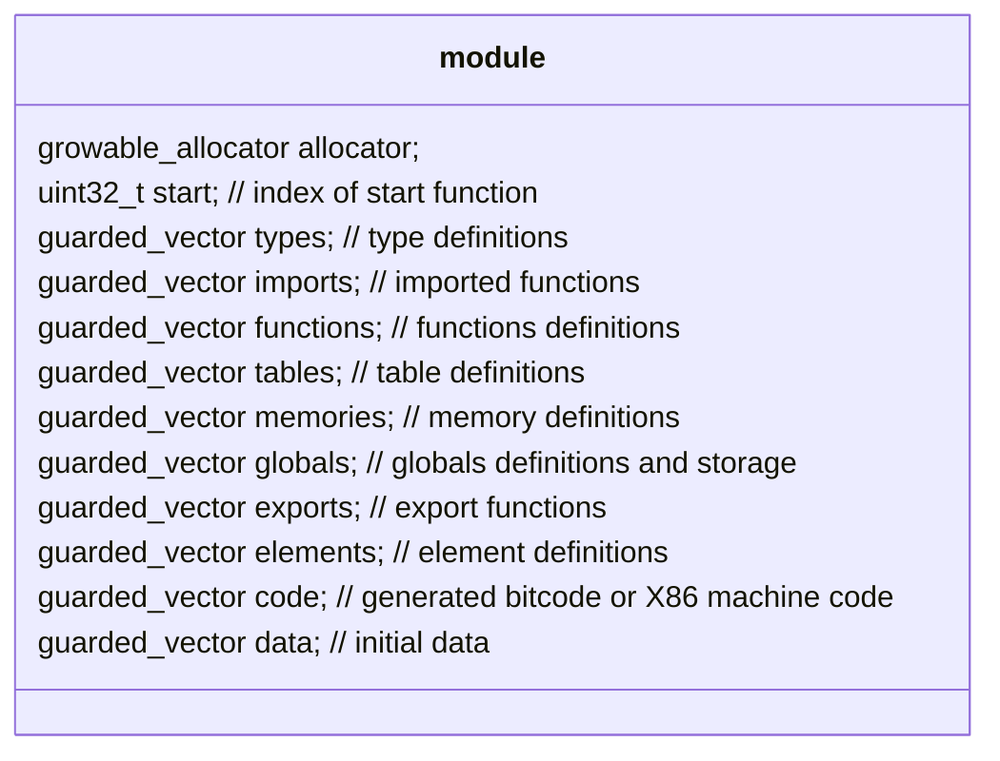

##### Execution Context

An execution context links a module with linear memory, stack, WASM allocator, and host functions.
It provides specific execution methods for EOS-VM-Interpreter and EOS-VM-JIT.
An execution context object is created by WASM interface as a part of a backend.

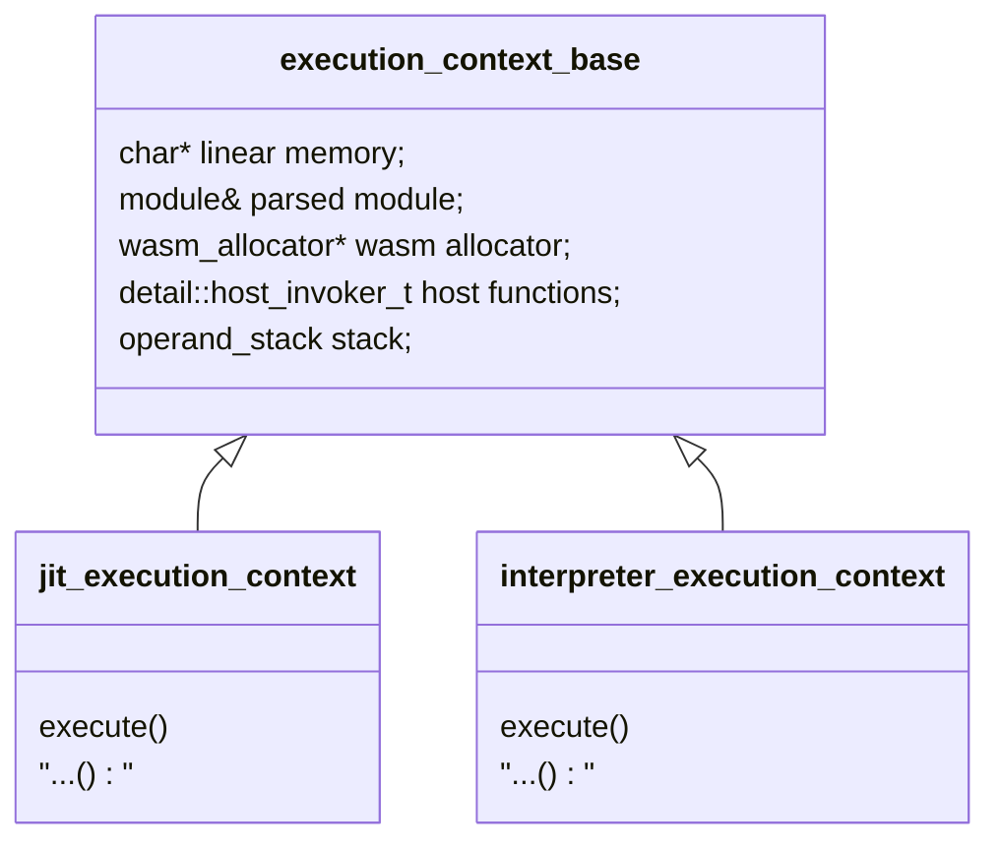

##### Backend
A backend represents a runtime environment to execute any action in a contract. 
Before execution, a backend object for the contract is created by WASM interface if it is not cached, 
otherwise the cached backend is used.

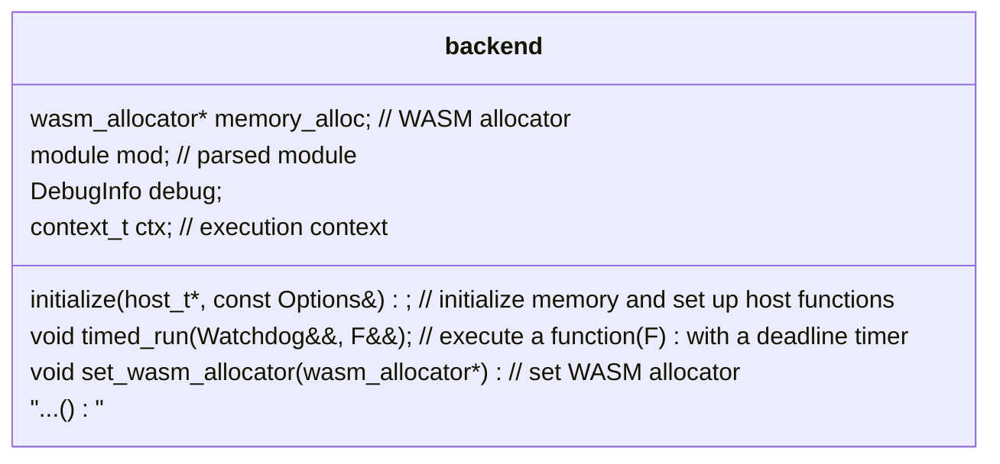

##### EOS-VM-OC Tierup
If `--eos-vm-oc-enable` is configured, EOS-VM-OC tierup is constructed by WASM interface at `nodeos` startup.
It is the runtime environment for EOS-VM-OC execution. It consists of a code cache, an executor and a memory.
The code cache stores OC compiled code. The executor executes the compiled code using the memory.
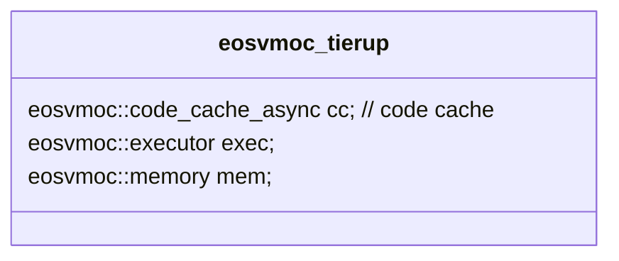

##### WASM Interface
WASM interface provides an abstraction of low level execution details, acting as an interface between
transaction level (receiver, action, applied context) and WASM code level (module, execution context/executor, memory).

A WASM interface object is created at `nodeos` startup. It consists of a backend cache for EOS-VM-Interpreter and EOS-VM-JIT execution,
and a EOS-VM-OC tierup object for EOS-VM-OC execution if enabled. To execute an action, simply call the `apply` method:
```
apply( const digest_type& code_hash, const uint8_t& vm_type, const uint8_t& vm_version, apply_context& context )
```

#### Execution

At high level, WASM interface executes an action in one of two cases:
1. EOS-VM-OC enabled: if the code has been OC compiled, the execution is performed by EOS-VM-OC; if the code is not ready, the execution falls back to EOS-VM-Interpreter or EOS-VM-JIT.
2. EOS-VM-OC not enabled: the execution is performed by EOS-VM-Interpreter or EOS-VM-JIT.

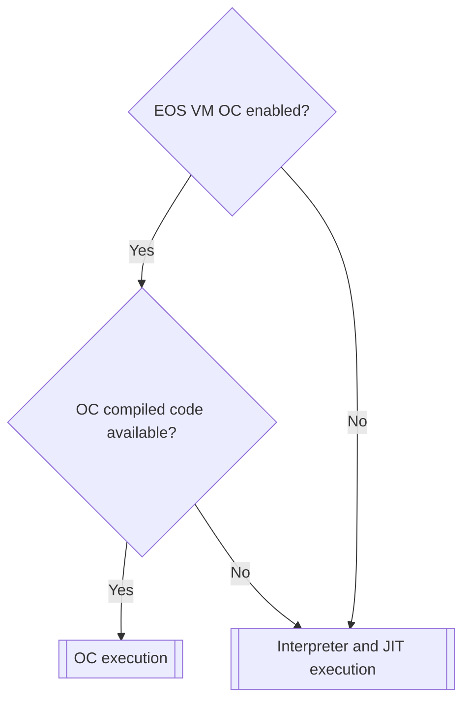

##### EOS-VM-Interpreter and EOS-VM-JIT Execution
In EOS-VM-Interpreter and EOS-VM-JIT execution, a backend is required per code.
WASM interface maintains a cache of used backends.
If a code's backend exists, it is re-initialized and reused; otherwise a new backend is created.

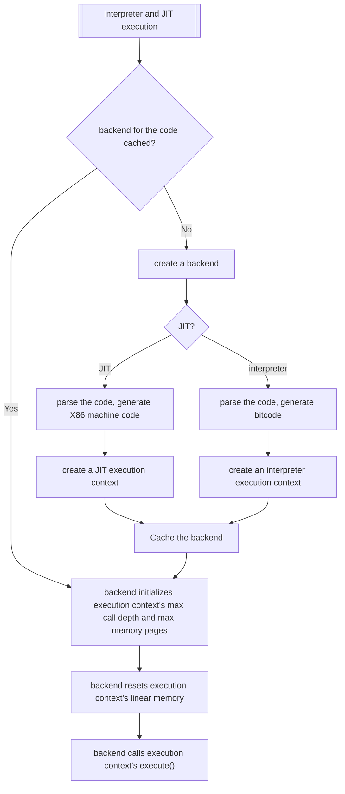

##### EOS-VM-OC Execution
In EOS-VM-OC, compiling and execution are done asynchronously. If the OC compiled code is not available, the execution falls back to EOS-VM-Interpreter or EOS-VM-JIT, while at the same time the compiling is kicked off in a new process.
The compiled code is cached both in memory and on disk for future uses.

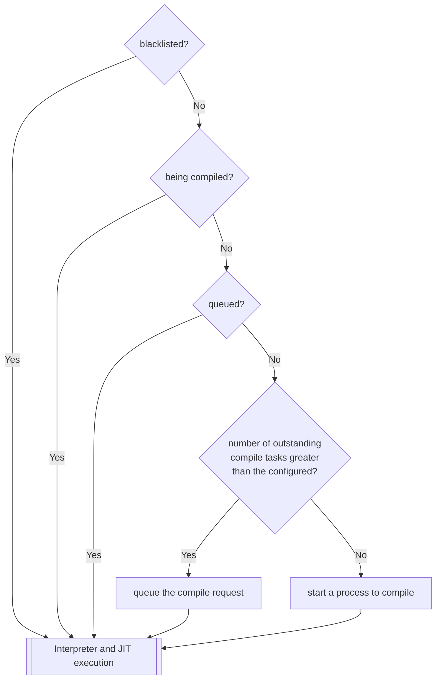


EOS-VM-OC tierup executes the compiled code using OC executor() and OC memory. 
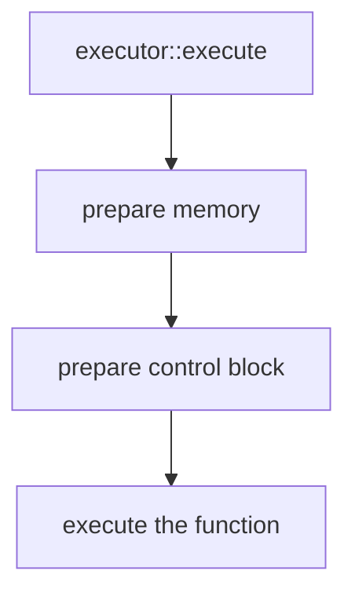

#### Parallel EOS-VM and EOS-VM-JIT Execution

To support read-only transaction execution on multiple threads, in the current implementation,
a separate WASM interface is required for each thread.
This ensures the backends (containing module and memory) of the same code running on different
threads are completely isolated from each other.

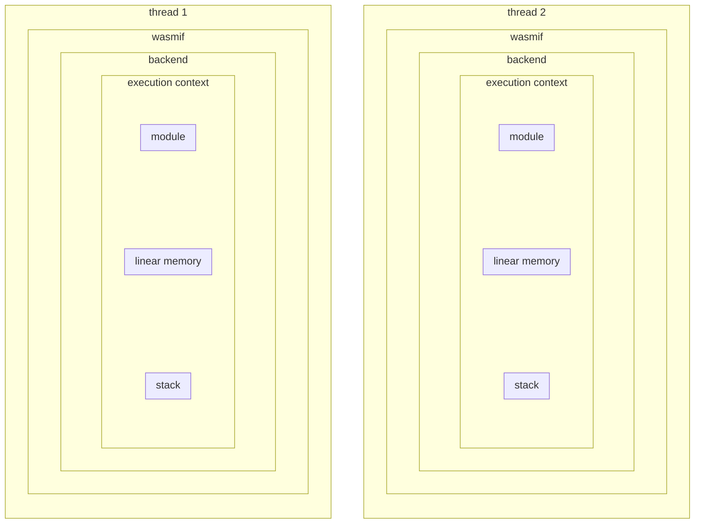

#### Parallel EOS-VM-OC Execution
EOS-VM-OC was designed with multi-threaded support in mind. Only one EOS-VM-OC tierup is required. 
Multiple threads share the same compiled code, while each thread uses its own executor and memory.

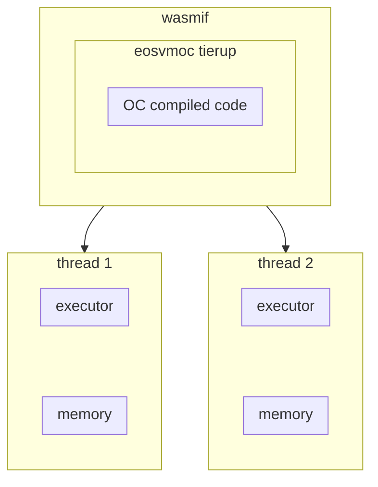

### Issues
#### Multiple WASM Interfaces
In parallel EOS-VM and EOS-VM-JIT execution, each thread uses a separate WASM interface. This causes several issues:
- The same contract are parsed multiple times on different threads.
- The multiple WASM interfaces and associated thread data make code complicated and hard to reason.
- It is not consistent with EOS-VM-OC where only one WASM interface is required.

#### Module is not thread safe
It is desirable to share the same parsed code -- module among threads.
Currently, however, a module stores global values (`current` in `global_variable`) directly.
It is possible multiple threads modify the same global at the same time.
This needs to be resolved before the same parsed code is shared among the same contract.

The following illustrates how globals are used in the current implementation.

```
   struct global_variable {
      global_type type;    // mutable or not
      init_expr   init;    // initial value
      init_expr   current; // current value
   };
```

In EOS-VM, `current` is modified by `set_global` in `eos-vm/include/eosio/vm/execution_context.hpp`
```
      inline void set_global(uint32_t index, const operand_stack_elem& el) {
      ...
      auto& gl = _mod.globals[index];
      ...
      visit(overloaded{ [&](const i32_const_t& i) {
         gl.current.value.i32 = i.data.ui;
         },
      ...
```
               
In EOS-VM-JIT, `current` is directly modified in `eos-vm/include/eosio/vm/x86_64.hpp`
```
      void emit_set_global(uint32_t globalidx) {
         ...
         auto& gl = _mod.globals[globalidx];
         void *ptr = &gl.current.value;
         ...
         emit_operand_ptr(ptr);
         ...
      }
```

All other sections in module are thread-safe. The following table summarizes the thread safety:

| Section   | Description                                                                       | Thread Safe?|
|-----------|-----------------------------------------------------------------------------------|-------------|
| allocator | used only during parsing                                                          | yes         |
| start     | index of start function, shareable                                                | yes         |
| types     | type definitions, shareable                                                       | yes         |
| imports   | imported functions, shareable                                                     | yes         |
| functions | function definitions, shareable                                                   | yes         |
| tables    | table definitions, shareable                                                      | yes         |
| memories  | memory definition, shareable                                                      | yes         |
| globals   | globals definitions and storage                                                   | no          |
| exports   | exported functions, shareable                                                     | yes         |
| elements  | used to initialize tables, shareable                                              | yes         |
| code      | instructions, shareable                                                           | yes         |
| data      | initial data, shareable                                                           | yes         |


#### Large Virtual Memory Required in EOS-VM-OC

The description of this section is mostly from https://github.com/AntelopeIO/leap/issues/645.

EOS-VM-OC uses a memory mirroring technique so that WASM linear memory can be both protected via page access permissions
and be resized without using `mprotect()`. EOS-VM-OC refers to these mirrors as "slices".

Prior to 2.1/3.1, Antelope's WASM memory could never exceed 33MiB. EOS-VM-OC would set up `33MiB/64KiB+1=529` slices each
with approximately `4GiB+33MiB` of virtual memory. This meant that EOS-VM-OC required approximately `529*(4GiB+33MiB)` of virtual memory;
about 2.1TiB.

In 2.1+/3.1+ Antelope technically (but Leap does not reliably) supports WASM memory up to full 4GiB (Leap's supported WASM limits 
are only those as defined in the reference contracts which remain 33MiB). EOS-VM-OC was modified so that any growth beyond 33MiB
is handled via `mprotect()`. This allows the optimization to remain in replace for all supported usages of Leap, while still allowing
Leap to technically support the full Antelope protocol which allows any size up to 4GiB. However, this support still required 
increasing the size of a slice to a full 8GiB of virtual memory, meaning that EOS VM OC now requires `529*8GiB` of virtual memory; about 4.2TiB.

In EOS-VM-OC memory implementation, a prologue reserves the memory for fixed globals, table elements, and control block.
Given a base virtual memory address and a WASM linear memory, 
Slice 1 maps memory of prologue from the WASM linear memory starting address to base virtual memory address,
Slice 2 maps memory of (prologue + 1 page) from the WASM linear memory starting address to (base virtual memory address + 8GB),
...,
Slice 529 maps memory of (prologue + 528 pages) from the WASM linear memory starting address to (base virtual memory address + 528 * 8GB)

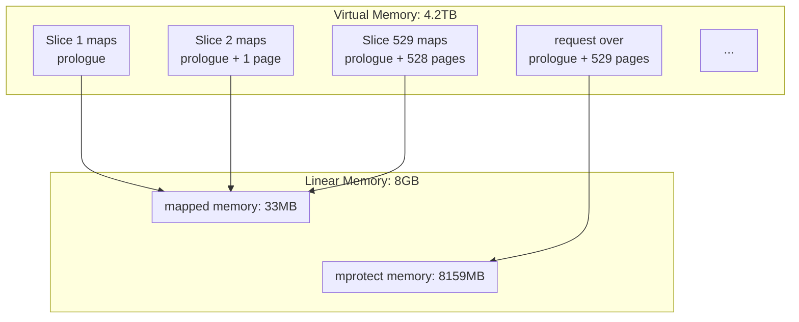

As EOS-VM-OC requires a separate memory for each executing thread, this demands a large total virtual memory.
For example, if 16 parallel threads are allowed with the current strategy of requiring 529 slices per thread, 
that would require `16*4.2TiB` of virtual memory: more virtual memory than allowed on most processors. 
Future efforts, like sync calls and background memory scrubbing, will also increase the need for more active slice sets.

#### Virtual Memory Available to User Space Not Calculated Accurately

To determine the number of threads allowed for EOS-VM-OC, we need to know total virtual memory available to user space.
Currently we use `VmallocTotal` in `/prop/meminfo`. This is not accurate, as `VmallocTotal` reports virtual memory for kernel allocation;
kernel itself uses some of it.

#### Not Fallback to EOS-VM-Interpreter or EOS-VM-JIT When OC Compiled Code is Not Available
In current parallel read-only transaction implementation, at `nodeos` startup, if EOS-VM-OC is enabled,
only EOS-VM-OC is set up to support parallel execution, EOS-VM-Interpreter and EOS-VM-JIT are not set up to do so.
This caused a problem that an execution cannot fall back to run parallelly if the OC compiled code is not available.
A workaround was implemented to retry the execution in the future round. 
This is not optimal, as it might take a while before the compile is done and the user will wait for
non-deterministic time to get the transaction result.

## Proposed Solutions

### Use Single WASM Interface and Compile the Same Contract Only Once in EOS-VM and EOS-VM-JIT

To prevent issues of multiple WASM interfaces discussed above, it is proposed a single WASM interface is used.

To avoid parsing contract code multiple times, a module is to be shared by multiple execution contexts.
After a code is first parsed and a module is created, the module is cached, until removed from the cache when last block
its code was used is before LIB and its linked execution context is not running. A new backend constructor
takes a module as an input and skips parsing.

To resolve the issue of potential multiple threads modifying the same global stored in the module,
globals storage is moved out to the end of linear memory. Protection will be put into place to prevent this section is accessed
by contract code.


Functions `set_global` and `get_global` in `execution_context.hpp`, `emit_get_global` and `emit_set_global` in `x86_64.hpp` will
be modified to access globals in linear memory.

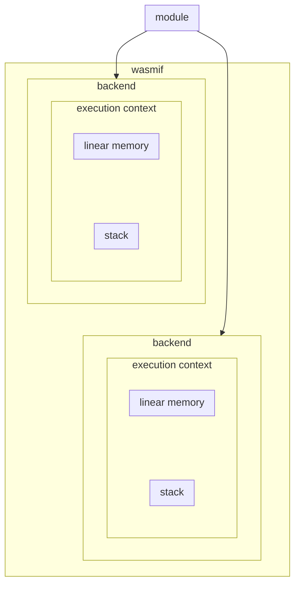

### Reduce Memory Slice Counts
To conserve virtual memory to support more threads, We need to reduce the threshold where EOS VM OC transitions
from mirroring to `mprotect()`.

We plan to
- Gather memory usage from existing contracts.
  * Download a January 2022 snapshot from the mainnet.
  * Modify `libraries/chain/webassembly/runtimes/eos-vm-oc/gs_seg_helpers.c/eos_vm_oc_grow_memory()` to keep track the largest number of linear memory the current code uses, and modify `eosvmoc::executor::execute()` to report the larget number at the end of the action execution.
  * Start from the snapshot and sync with a mainnet peer node.
  * Find max and 95 percentile of number of linear memory pages used by all codes. This is to make sure vast majority of executions do not need using `mprotect`.
- Add a private compile option defining the threshold number of pages where the transition between the two approaches occurs.
  * In `chain/CMakefile`, set a private variable `max_num_slices` with the value of the 95 percentile, and pass it to C++ code using `add_definitions`.
  * Use `max_num_slices` to set up memory slices in `memory::memory()`.

### Calculate Virtual Memory Available to User Space Accurately
We plan to use `/proc/self/maps`, find the difference of addresses between `nodeos` program text and `vsyscall` and deduct the total
size of all memory segments.

A memory maps look like
```
560e88dc8000-560e88dcc000 rw-p 04dee000 103:03 20582300                  /home/lh/work/leap-4-0-vmoc-main-thread/build/bin/nodeos
560e88dcc000-560e88df7000 rw-p 00000000 00:00 0
560e8a03d000-560e8a107000 rw-p 00000000 00:00 0                          [heap]
...
7ffdceec3000-7ffdceee4000 rw-p 00000000 00:00 0                          [stack]
7ffdcefe2000-7ffdcefe6000 r--p 00000000 00:00 0                          [vvar]
7ffdcefe6000-7ffdcefe8000 r-xp 00000000 00:00 0                          [vdso]
ffffffffff600000-ffffffffff601000 --xp 00000000 00:00 0                  [vsyscall]
```

### Fallback to EOS-VM-Interpreter or EOS-VM-JIT When OC Compiled Code is Not Available
At `nodeos` startup, if EOS-VM-OC is enabled,
EOS-VM-OC, EOS-VM-Interpreter, and EOS-VM-JIT all need to be set up to support parallel execution.
In OC execution, if the OC compiled code is not available, the execution falls back to run parallelly in
EOS-VM-Interpreter or EOS-VM-JIT. 
