# Parallelize Read-only Transaction Execution

Continuing PR (https://github.com/AntelopeIO/leap/pull/558) (on branch https://github.com/AntelopeIO/leap/tree/send_read_only_trx), this document describes an approach to parallelize read-only transaction execution.

## Existing Requests Handling

### HTTP RPC Requests

RPC requests can be classified into synchronous reads and asynchronous read-writes.
- Synchronous reads are those whose names start with `get_`, like `get_info`, `get_block`, .... They do not modify states, and are executed immediately.
- Asynchronous read-writes are the rest, like `compute_transaction`, `send_transaction`, and `send_transaction2`.  They may modify states and are executed asynchronously via producer thread scheduling.

The diagram below depicts `get_info` and `send_transaction2` handling.

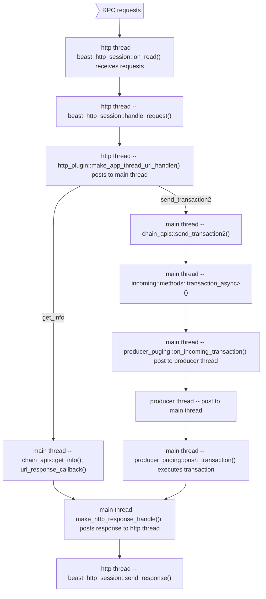

Net requests can be classified into sync and non-sync:
- Non-sync requests are handshake_message, go_away_message, notice_message, time_message, request_message, sync_request_message. They do not modify states.
- Sync requests are signed_block, packed_transaction. They may modify states.

#### handshake_message
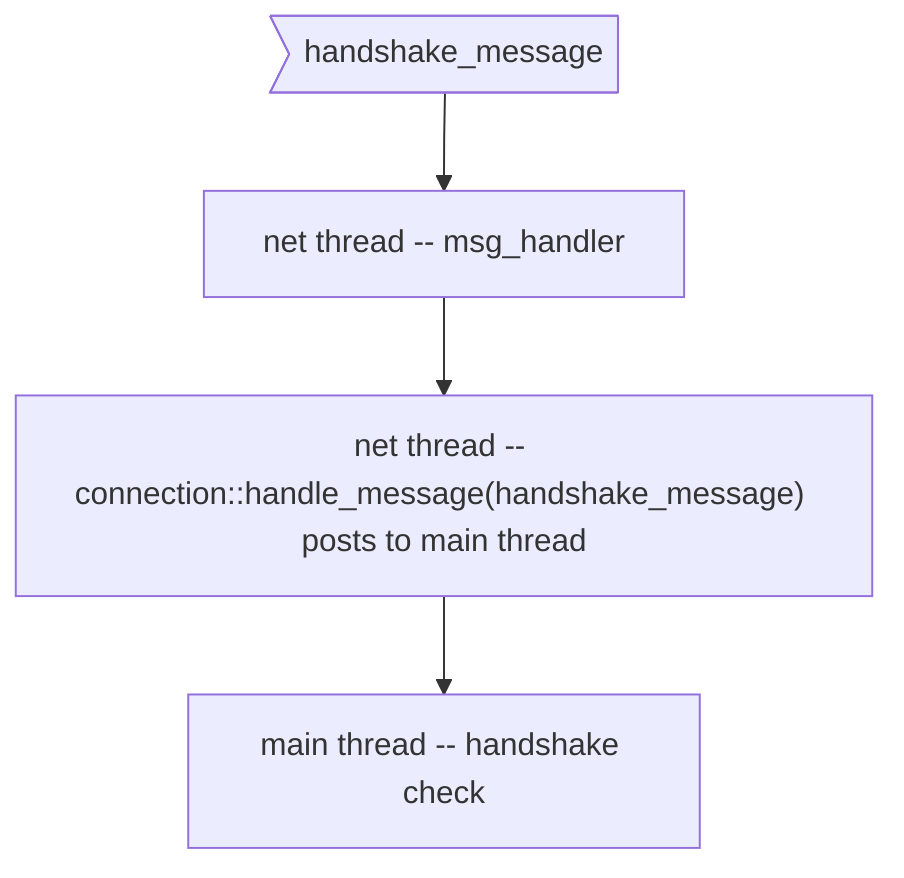

#### go_away_message
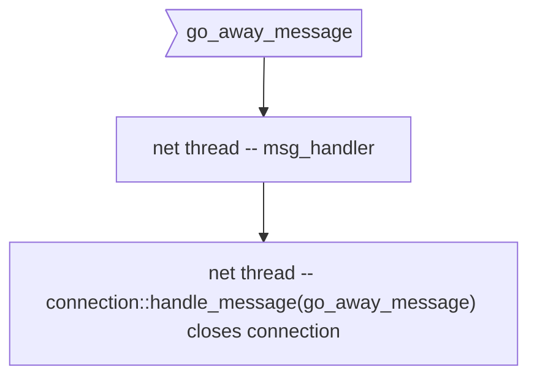
#### time_message
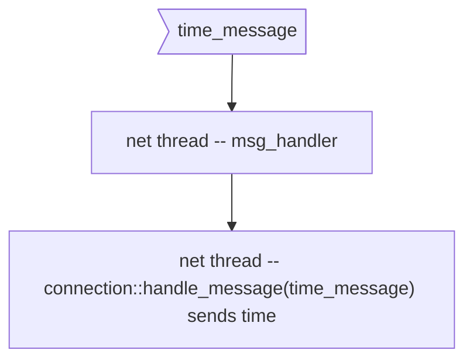
#### notice_message
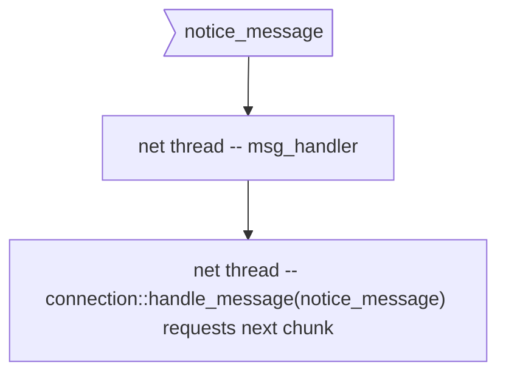
#### request_message
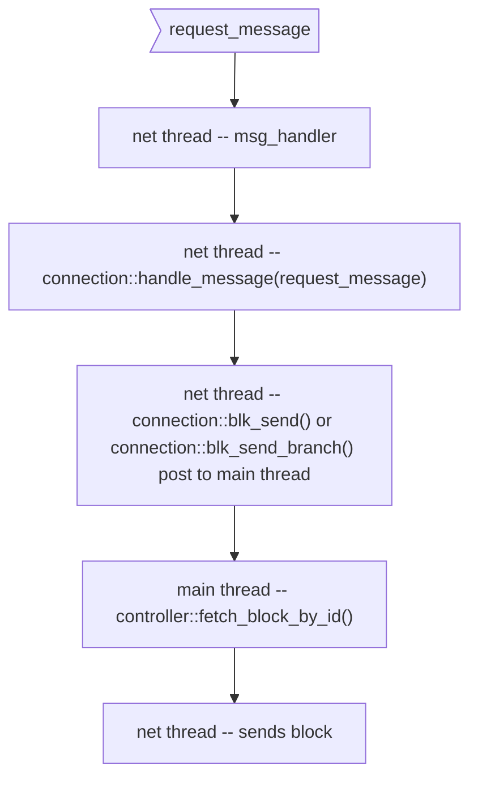

#### sync_request_message
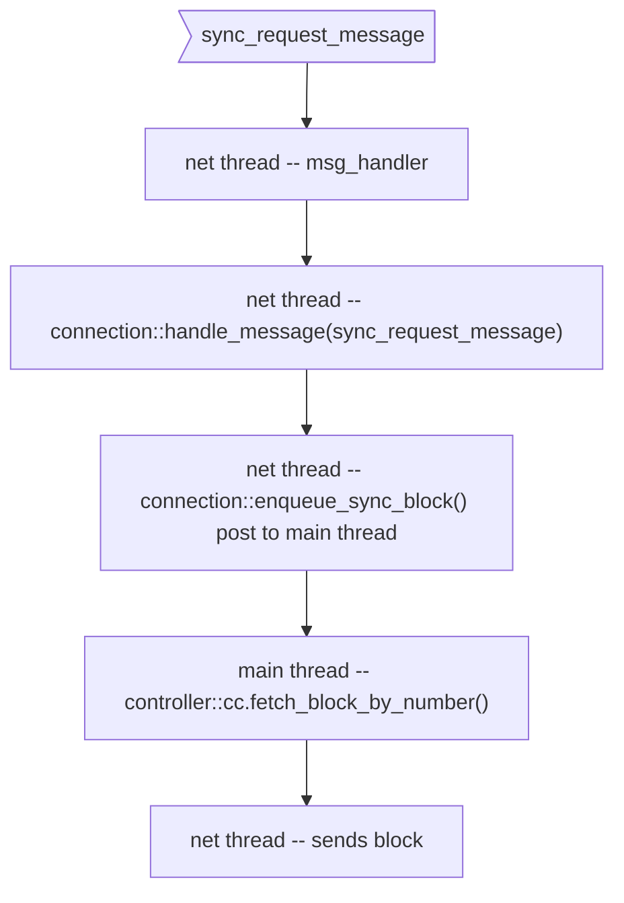

#### packed_transaction_ptr
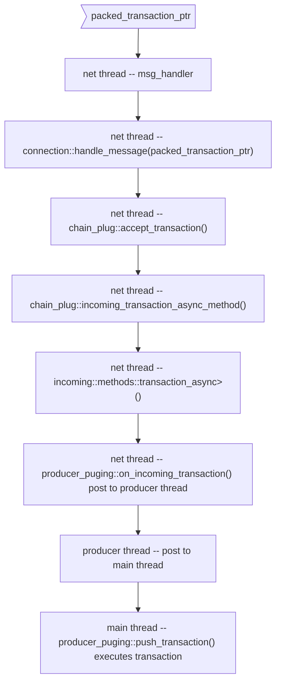
#### signed_block_ptr
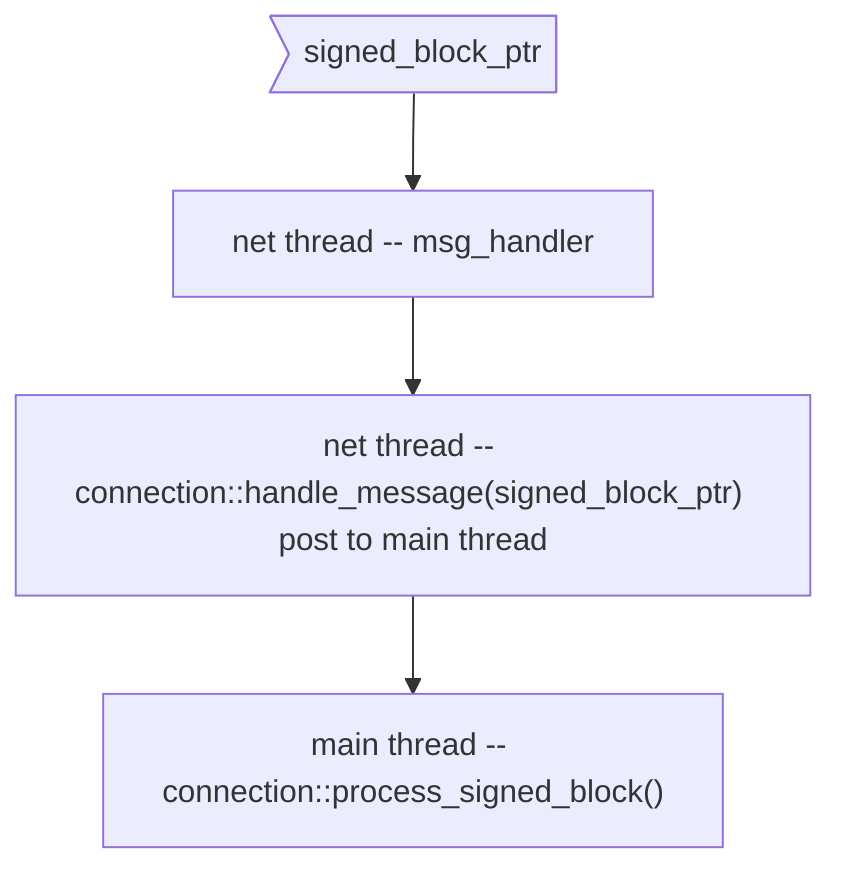

## Design Decisions
The API node toggles between `read-write` and `read-only` windows. In `read-write` window, the node handles requests normally, except queuing read-only transactions . In `read-only` window, the node runs read-only transactions in the read-only thread pool, and handles `get_` types of RPC requests and non-sync Net requests as they come in while hold on processing RPC write and Net sync requests.

### When to Switch Windows?
Configurable options read-write window time, and read-only window time, number of read-only transaction threshold are provided. 
- At the end of read-write window and if read-only transaction queue has entries, or the number of outstanding read-only transactions reaches the threshold, switch to read-only window. This ensures both low and high number of read-only transaction cases are handled.
- At the end of read-only window or read-only queue becomes empty, switch to read-write window. The threshold option helps to make sure not too many read-only transactions are held if last read-only window exits before its end time.

### How to Handle Write and sync Requests in `read-only` Window?
During read-only window, new write and sync requests keep coming in. How to handle them?
- Drop the requests. This in not acceptable as it changes the behavior of the API node.
- Queue the requests.  This is complex, considering different types of requests, how and where to re-process them.
- Repost to the main thread. All write requests are handled by the main thread for some period of time. In the functor of the post to the main thread, if node is in `read-only` window, re-post it to the main thread. Care must be taken to prevent infinite loops. Should the order of write requests be kept?

## Call Flow

### Read-write Window
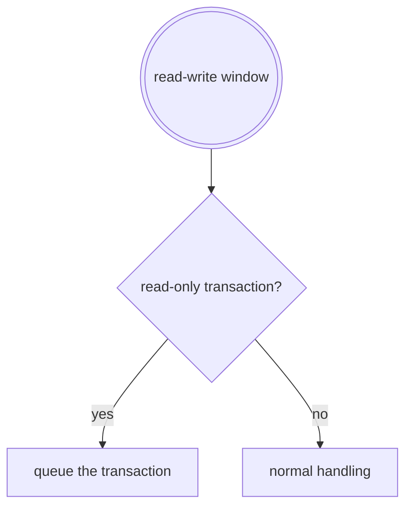

### Read-only Window
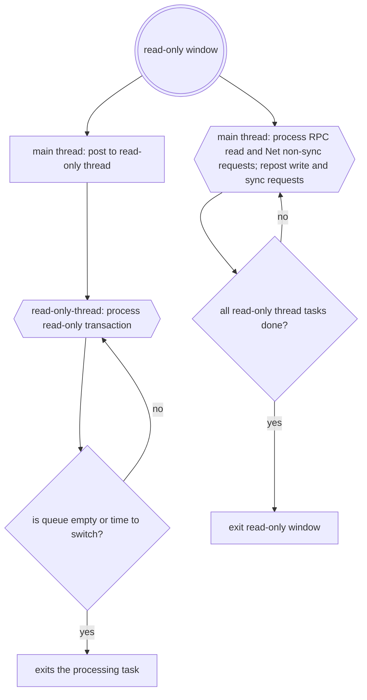

### Read-only Transaction Queue
```c++
struct read_only_transaction {
   send_read_only_transaction_params params;
   next_func_t  next;
};

std::queue <read_only_transaction> read_only_trx_queue;
```
Protected by a mutex. A transaction failed due to read window deadline but not transaction deadline will be put back into the queue for next round.

### Configuration Options

- `read-only-transaction-num-threads`: the number of threads in read-only transaction thread pool. Default to `0`. If `0`, multi-threaded execution is not used; read-only transactions are executed single threaded
- `read-write-window-time`: time in milliseconds the read-write window runs. Default to 500 milliseconds
- `read-only-window-time`: time in milliseconds the read-only window runs. Must be equal to or greater than `max-read-only-transaction-time`. Default to 200 milliseconds
- `read-only-transaction-threshold`: when the number of queued read-only transactions reaches the threshold, node switches to read-only mode, even it is before the end of read-write window. Default to 0. If 0, this option is not used.
- `read-only-window-margin`: when the time remains in the read-only window is less than the margin, no new transactions are scheduled in read-only threads. Default to 5 milliseconds.
- `max-read-only-transaction-time`: time in milliseconds a read-only transaction can execute before being considered invalid. Default to 150 milliseconds. This option has already been implemented by #558


## Thread Safety

- Safety between read-only transaction threads and other `nodeos` threads
   - _main_ thread: The `main` thread only performs read-only requests. It does not have any conflicts with read-only threads.
   - _chain_ thread: `chain` threads are used in `apply_block`, `log_irreversible`, `finalize_block`,  `create_block_state_future`. Those do not run while in read-only window.
   - _net_ thread: Non-read requests are reposted to (held by) the main thread. No conflicts with read-only transaction execution.
   - _http_ thread: It is used to receive requests and send back responses. No conflicts with read-only transaction execution.
   - _prod_ thread: It is used in on_incoming_transaction_async, which is not running in read-only window
   - _resource monitor_ thread: Resource monitor does not have any conflicts with any transaction execution.
- Safety between read-only transaction threads: no writes are made into `chainbase` and global states when a read-only transaction is executed. This is achieved by PR #558

## Tests

- number of read-only threads is 0
- number of read-only threads is 1
- number of read-only transactions greater than number of threads
- `read-write-window-time` test
- `read-only-transaction-window-time` test
- `read-only-transaction-threshold` test
- `read-only-window-margin` test
- read-only transactions are processed within one read window
- read-only transactions are processed in multiple read windows
- make other RPC requests while read-only transactions are executed
