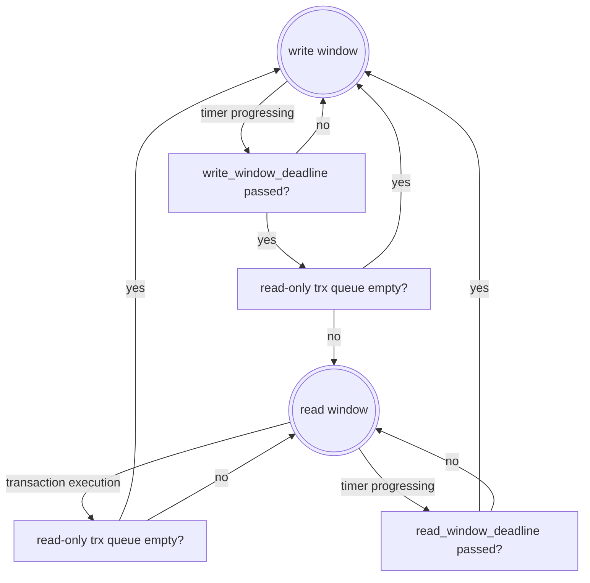

# Parallelize Read-only Transaction Execution

Currently all transactions are executed in the main thread. To take advantage of multi-core architecture, executing read-only transactions in a separate thread pool would make the main thread have more time to process other operations and improve performance.

Continuing the work to support read-only transaction RPC by PR (https://github.com/AntelopeIO/leap/pull/558) (on branch https://github.com/AntelopeIO/leap/tree/send_read_only_trx), this document describes an approach to parallelize read-only transaction execution.

## Main Ideas
The node toggles between `write` and `read` windows. In `write` window, the node operates normally, except read-only transactions are queued for later parallel execution in `read` window. In `read` window, the queued read-only transactions are executed in a dedicated thread pool, while operations which are safe to read-only transaction execution are executed in the main thread.

Several terms are defined to help understand the design.

- *read-only transaction* - an Antelope transaction that does not modify state
- *read operation* - a task (like `get_info`) that does not modify state and any global data used during read-only transaction execution. It is safe to run in parallel with read-only transaction.
- *write operation* - a task (like `send_transacttion2`) that modifies state or any global data used during read-only transaction execution. It is not safe to run in parallel with read-only transaction.

## Existing Operation Analysis
This section analyzes thread safety of existing operations to read-only transaction execution.

### Chain APIs
Chain APIs can be classified into reads and writes.
- Reads are those whose names start with `get_`, like `get_info`, `get_activated_protocol_features`, `get_block`, `get_block_info`. They do not modify states.
- Writes are the rest of requests: `compute_transaction`, `push_transaction`, `push_transactions`, `send_transaction`, `send_transaction2`, and `push_block`.  They may modify states.

Chain APIs are received on the HTTP thread, processed on the main thread (and producer thread for non-get requests), and responses are sent on the HTTP thread.

| API                             | priority    |  Global data modified                                | Safe to read-only trx? |
|---------------------------------|-------------|------------------------------------------------------|------------------------|
| get_info                        | medium_high | none                                                 | yes                    |
| get_activated_protocol_features | medium_low  | none                                                 | yes                    |
| get_block                       | medium_low  | none                                                 | yes                    |
| get_block_info                  | medium_low  | none                                                 | yes                    |
| get_block_header_state          | medium_low  | none                                                 | yes                    |
| get_account                     | medium_low  | none                                                 | yes                    |
| get_code                        | medium_low  | none                                                 | yes                    |
| get_code_hash                   | medium_low  | none                                                 | yes                    |
| get_abi                         | medium_low  | none                                                 | yes                    |
| get_raw_code_and_abi            | medium_low  | none                                                 | yes                    |
| get_raw_abi                     | medium_low  | none                                                 | yes                    |
| get_table_rows                  | medium_low  | none                                                 | yes                    |
| get_table_by_scope              | medium_low  | none                                                 | yes                    |
| get_currency_balance            | medium_low  | none                                                 | yes                    |
| get_currency_stats              | medium_low  | none                                                 | yes                    |
| get_producers                   | medium_low  | none                                                 | yes                    |
| get_producer_schedule           | medium_low  | none                                                 | yes                    |
| get_scheduled_transactions      | medium_low  | none                                                 | yes                    |
| abi_json_to_bin                 | medium_low  | none                                                 | yes                    |
| abi_bin_to_json                 | medium_low  | none                                                 | yes                    |
| get_required_keys               | medium_low  | none                                                 | yes                    |
| get_transaction_id              | medium_low  | none                                                 | yes                    |
| get_consensus_parameters        | medium_low  | none                                                 | yes                    |
| get_accounts_by_authorizers     | medium_low  | none                                                 | yes                    |
| get_transaction_status          | medium_low  | none                                                 | yes                    |
| send_read_only_transaction      | medium_low  | none                                                 | yes                    |
| compute_transaction             | low         | main thread: temporally change chainbase             | no        |
| push_block                      | medium_low  | main thread: chainbase, forkdb, producer, controller | no |
| push_transaction                | low         | main thread: chainbase, forkdb, producer, controller | no |
| push_transactions               | low         | main thread: chainbase, forkdb, producer, controller | no |
| send_transaction                | low         | main thread: chainbase, forkdb, producer, controller | no |
| send_transaction2               | low         | main thread: chainbase, forkdb, producer, controller | no |

### Producer APIs
They are received on the HTTP thread, processed on the main thread, and responses are sent on the HTTP thread.

| API                                        | priority    |  Global data modified        | Safe to read-only trx? |
|--------------------------------------------|-------------|------------------------------|------------------------|
| pause                                      | medium_high | main thread: producer's \_pause_production  | yes     |
| resume                                     | medium_high | main thread: producer's \_pause_production  | yes     |
| paused                                     | medium_high |                              | yes                    |
| get_runtime_options                        | medium_high |                              | yes                    |
| update_runtime_options                     | medium_high | main thread: producer plugin and controller configs | no (configs used by trx processing|
| add_greylist_accounts                      | medium_high | main thread: controller resource_greylist  | yes (not used in read-only trx handling. only used by max_bandwidth_billed_accounts_can_pay) |
| remove_greylist_accounts                   | medium_high | main thread: controller resource_greylist | yes       |
| get_greylist                               | medium_high |                              | yes                    |
| get_whitelist_blacklist                    | medium_high |                              | yes                    |
| set_whitelist_blacklist                    | medium_high | main thread:controller blacklist, whitelist|  no      |
| get_integrity_hash                         | medium_high |                              | yes                    |
| create_snapshot                            | medium_high |                              | yes                    |
| get_scheduled_protocol_feature_activations | medium_high |                              | yes                    |
| schedule_protocol_feature_activations      | medium_high |                              | no                     |
| get_supported_protocol_features            | medium_high |                              | yes                    |
| get_account_ram_corrections                | medium_high |                              | yes                    |
| get_unapplied_transactions                 | medium_high |                              | yes                    |

### Net APIs
Net APIs do not mutate states. They are received on the HTTP thread, processed on the main thread, and responses are sent on the HTTP thread.

| API                         | priority    | Global data modified           | Safe to read-only trx? |
|-----------------------------|-------------|--------------------------------|------------------------|
| connect                     | medium_high | main thread: net::connections  | yes                    |
| disconnect                  | medium_high | main thread: net::connections  | yes                    |
| status                      | medium_high | none                           | yes                    |
| connections                 | medium_high | none                           | yes                    |

### Trace APIs
Trace APIs do not go through main thread. They are executed only in http thread.
| API                         | priority |  Global data modified  | Safe to read-only trx? |
|-----------------------------|----------|------------------------|------------------------|
| get_block                   | NA       | none                   | yes                    |
| get_transaction_trace       | NA       | none                   | yes                    |

### DB Size API
| API                         | priority   |  Global data modified  | read-only thread safe  |
|-----------------------------|------------|------------------------|------------------------|
| get                         | medium_low |  none                  | yes                    |            

### Net Messages
Net messages can be classified into sync and non-sync:
- Non-sync messages do not modify states.
- Sync messages are signed_block, packed_transaction. They may modify states.

| Message            | priority | Global data modified            | threads involved            | Safe to read-only trx?  |
|--------------------|----------|---------------------------------|-----------------------------|-------------------------| 
| handshake          | medium   | none                            | net, main (handshake check) | yes                     |
| go_away            | NA       | none                            | net                         | yes                     |
| time               | NA       | none                            | net                         | yes                     |
| notice             | NA       | none                            | net                         | yes                     |
| request            | medium   | none                            | net, main (controller::fetch_block_by_id()) | yes     |
| sync_request       | medium   | none                            | net, main (controller::fetch_block_by_number()) | yes |
| packed_transaction | low      | chainbase, forkdb, producer, net, controller | net, producer, main | no                 |
| signed_block       | medium   | chainbase, forkdb, producer, net, controller | net, producer, main | no                 |

### SHiP
SHiP receives blockchain state data, saves it to files, and sends data to nodes who request it.

| Request                | priority |  Data modified       | Safe to read-only trx? |
|------------------------|----------|----------------------|------------------------|
| get_status_request     | medium   | internal             | yes                    |
| get_blocks_request     | medium   | internal             | yes                    |
| get_blocks_ack_request | medium   | internal             | yes                    |

## Design Decisions

### Configuration Options

Attempt is made to only introduce a minimum set of options. Other options might be added in the future if needed.
- `read-only-transaction-threads`: number of worker threads in read-only transaction thread pool. If it is `0`, read-only transactions are executed on the main thread sequentially. Default to `0`. The number of the threads will be limited by the virtual memory size the system has (see https://github.com/AntelopeIO/leap/issues/645).
- `read-only-write-window-time-us`: time in microseconds the `write` window lasts. For this option to take effect, `read-only-transaction-threads` must be set greater than 0. Default to `200,000` microseconds. 
- `read-only-read-window-time-us`: time in microseconds the `read` window lasts. For this option to take effect, `read-only-transaction-threads` must be set greater than 0. Default to `60,000` microseconds.

Note: `read-only-max-transaction-ms` (time in milliseconds a read-only transaction can execute before being considered invalid) was considered. But to keep new options minimal, for now, use the existing `max-transaction-time` for read-only transactions.

### Data Structures 

Three queues are proposed: the existing internal priority queue in `execution_priority_queue` of appbase is replaced with read operation queue and write operation queue, and a new read-only transaction queue is added.
- `read operation queue` stores read operations which are safe to read-only transaction execution. `appbase`'s `post` method is enhanced to have a new parameter indicating opertion type.
- `write operation queue` stores write operations which are not safe to read-only transaction execution.
- `read-only transaction queue` stores read-only transactions. It is a deque.

### Window Processing

In `write window`, operations in `write operation queue` and `read operation queue` are executed by the main thread, while read-only transactions are queued in the read-only transaction queue for later execution in the `read window`. To select next operation to execute, priority and order of front entries in `write operation queue` and `read operation queue` are compared; the one with higher priority or higher order (older) is chosen. This is the existing behavior.

In `read window`, only operations in `read operation queue` are executed by the main thread, and transactions in read-only queue are executed by the read-only. Design details are:
- At the start of `read-window`, all threads in the pool are signaled to start process read-only transactions. Each thread enters a loop of pulling one transaction a time from the front of the read-only transaction queue and executing it. New incoming read-only transactions are placed at the back of the queue. The queue is protected by mutex.
- If less than 5% (hardcoded for now) of `read-only-read-window-time-us` time remains in the `read window`, a thread will stop scheduling new transaction for execution and exit the execution loop.
- At the end of the window, non-finished transactions are put to the front of the read-only transaction queue so that they can be executed the first in the next round.
- Transactions exceeding `max-transaction-time` will be discarded and a proper response will be sent back.
- Before a transaction is selected for execution, it is desirable to check if the HTTP connection is still up. If not, simply discard the transaction. A warning log or a stats should be generated so the node operator can adjust the configuration options or take any other actions like throttling read-only transactions.

### Window Toggling
 
- From `write window` to `read window`: at the end of the `write window` and read-only transaction queue not empty.
- From `read window` to `write window`: when read-only transaction queue is empty; or at the end of `read window`.

In the following state diagram, `write_window_deadline = time when write window starts + write-window-time`, and `read_window_deadline = time when read window starts + read-window-time`

### Requests Starvation Discussion
- Comparing with executing all requests in the single main thread, offloading read-only transactions to a separate thread pool makes the time needed to process read-only transactions available for `write operations` and `read operations`, resulting more operations are processed. 
- We are most concerned about starvation of block sync operation. Its priority is medium, which is higher than the majority of read operations. When `read window` is switched to `write window`, if the front operation in the write window queue is block sync, it is likely to be selected for execution. The worst case is a block sync at the front of the queue right before the execution window is switched to read-window. Configuring a small `read-only-read-window-ms` would reduce the waiting time for block sync. Another point is `write window` is switched to `read window` if there are read-only transactions in the read-only transaction queue; this means the main thread has already saves the time requried to executing those read-only transactions. The block sync is processed earlier than it would be in the existing single thread approach otherwise.
- In `read window`, whenever read-only transaction queue becomes empty, `read window` is switched to `write window`. This helps to process any write operations earlier if they are available.
- To prevent read-only transactions from stuck in `read window` and `write operations` from stuck in `write window` for too long, `read-only-write-window-ms` and `read-only-read-window-ms` should be configured to small numbers, especially when `read-only-transaction-threads` is set to be big. This promotes rapid toggling of the two windows and reducing starvation.

## Thread Safety In Read Window

- Safety between read-only transaction threads and other `nodeos` threads
   - _main_ thread: See above sections.
   - _chain_ thread: `chain` threads are used in `apply_block`, `log_irreversible`, `finalize_block`,  `create_block_state_future`. Those do not run while in `read` window.
   - _net_ thread: It is used for low-level networking. No conflicts with read-only transaction execution.
   - _http_ thread: It is used to receive requests and send back responses. No conflicts with read-only transaction execution.
   - _prod_ thread: _prod_ thread is used by `on_incoming_transaction_async` in `producer_plugin.cpp`. This method will be modified such that it is not running in `read` window.
   - _resource monitor_ thread: Resource monitor does not have any conflicts with any transaction execution.
- Safety between read-only transaction threads: no writes are made into `chainbase` and global states when a read-only transaction is executed. This is achieved by PR [#558](https://github.com/AntelopeIO/leap/pull/558)

## Tests

- number of read-only threads is 0
- number of read-only threads is 1
- number of read-only transactions greater than number of threads
- `read-only-write-window-time-us` test
- `read-only-read-window-time-us` test
- read-only transactions are processed within one read window
- read-only transactions are processed in multiple read windows
- initiate RPC requests while read-only transactions are executed
