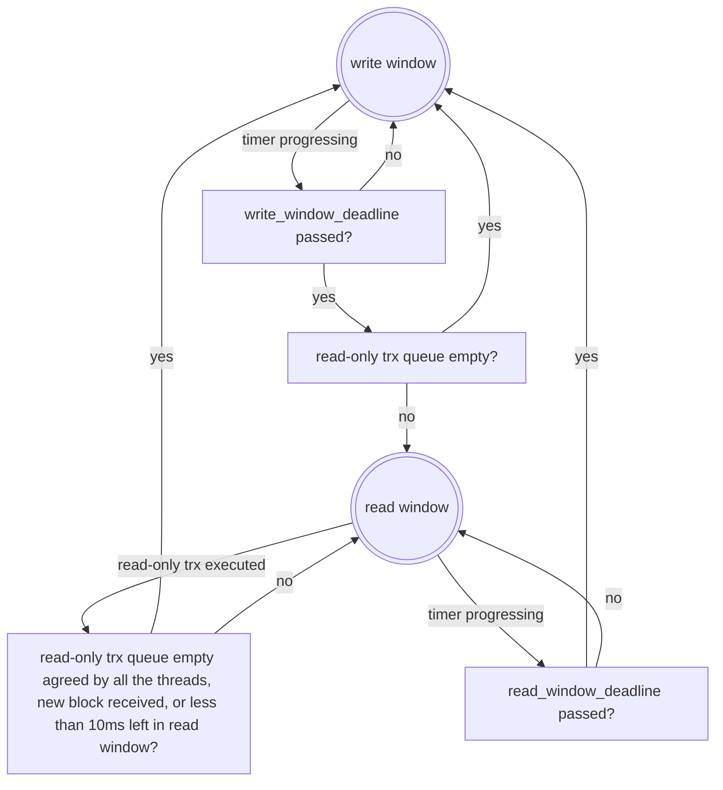

# Parallelize Read-only Transaction Execution

Currently all transactions are executed in the main thread. To take advantage of multi-core architecture, executing read-only transactions in a separate thread pool would make the main thread have more time to process other operations and improve performance.

Continuing the work to support read-only transaction RPC by PR (https://github.com/AntelopeIO/leap/pull/558) (on branch https://github.com/AntelopeIO/leap/tree/send_read_only_trx), this document describes an approach to parallelize read-only transaction execution.

## Main Ideas
The node toggles between `write` and `read` windows. In `write` window, the node operates normally, except read-only transactions are queued for later parallel execution in `read` window. In `read` window, the queued read-only transactions are executed in a dedicated thread pool, while operations safe to read-only transaction execution are executed by the main thread.

Several terms are defined to help understand the design.

- *read-only transaction* - an Antelope transaction that does not modify any state.
- *read operation* - a task that does not modify any state that is accessible (even indirectly) by read-only transaction execution. It is safe to execute these on the main thread in parallel with read-only transactions. As the name suggests, these include pure read operations, e.g. `get_info`, but it can also include other operations executing on the main thread that may mutate state that does not impact read-only transactions executing on separate threads, e.g. `pause` and `resume` from the producer API.
- *write operation* - a task that may modify state that can be accessible by read-only transaction execution, e.g. `send_transaction2` which can modify Chainbase state. It is not safe to execute these operations in parallel with read-only transactions.

## Existing Operation Analysis
This section analyzes thread safety of existing operations to read-only transaction execution.

### Chain APIs
Chain APIs can be classified into reads and writes.
- Reads are those whose names start with `get_`, like `get_info`, `get_activated_protocol_features`, `get_block`, `get_block_info`. They do not modify states.
- Writes are the rest of requests: `compute_transaction`, `push_transaction`, `push_transactions`, `send_transaction`, `send_transaction2`, and `push_block`.  They may modify states.

Chain APIs are received on the HTTP thread, processed on the main thread (and producer thread for non-get requests), and responses are sent on the HTTP thread.

| API                             | priority    |  Global data modified                       | Safe to read-only trx? | Safe to run in parallel? |
|---------------------------------|-------------|---------------------------------------------|------------------------|--------------------------|
| get_info                        | medium_high | none                                        | yes                    | yes                      |
| get_activated_protocol_features | medium_low  | none                                        | yes                    | yes                      |
| get_block                       | medium_low  | none                                        | yes                    | yes                      |
| get_block_info                  | medium_low  | none                                        | yes                    | yes                      |
| get_block_header_state          | medium_low  | none                                        | yes                    | yes                      |
| get_account                     | medium_low  | none                                        | yes                    | yes                      |
| get_code                        | medium_low  | none                                        | yes                    | yes                      |
| get_code_hash                   | medium_low  | none                                        | yes                    | yes                      |
| get_abi                         | medium_low  | none                                        | yes                    | yes                      |
| get_raw_code_and_abi            | medium_low  | none                                        | yes                    | yes                      |
| get_raw_abi                     | medium_low  | none                                        | yes                    | yes                      |
| get_table_rows                  | medium_low  | none                                        | yes                    | yes                      |
| get_table_by_scope              | medium_low  | none                                        | yes                    | yes                      |
| get_currency_balance            | medium_low  | none                                        | yes                    | yes                      |
| get_currency_stats              | medium_low  | none                                        | yes                    | yes                      |
| get_producers                   | medium_low  | none                                        | yes                    | yes                      |
| get_producer_schedule           | medium_low  | none                                        | yes                    | yes                      |
| get_scheduled_transactions      | medium_low  | none                                        | yes                    | yes                      |
| abi_json_to_bin                 | medium_low  | none                                        | yes                    | yes                      |
| abi_bin_to_json                 | medium_low  | none                                        | yes                    | yes                      |
| get_required_keys               | medium_low  | none                                        | yes                    | yes                      |
| get_transaction_id              | medium_low  | none                                        | yes                    | yes                      |
| get_consensus_parameters        | medium_low  | none                                        | yes                    | yes                      |
| get_accounts_by_authorizers     | medium_low  | none                                        | yes                    | yes                      |
| get_transaction_status          | medium_low  | none                                        | yes                    | yes                      |
| send_read_only_transaction      | low         | none                                        | yes                    | yes                      |
| compute_transaction             | low         | main thread: temporally change chainbase             | no            | no                       |
| push_block                      | medium_low  | main thread: chainbase, forkdb, producer, controller | no            | no                       |
| push_transaction                | low         | main thread: chainbase, forkdb, producer, controller | no            | no                       |
| push_transactions               | low         | main thread: chainbase, forkdb, producer, controller | no            | no                       |
| send_transaction                | low         | main thread: chainbase, forkdb, producer, controller | no            | no                       |
| send_transaction2               | low         | main thread: chainbase, forkdb, producer, controller | no            | no                       |

### Producer APIs
They are received on the HTTP thread, processed on the main thread, and responses are sent on the HTTP thread.

| API                                        | priority    |  Global data modified        | Safe to read-only trx? | Safe to run in parallel? |
|--------------------------------------------|-------------|------------------------------|------------------------|--------------------------|
| pause                                      | medium_high |                              | yes                    | no                       |
| resume                                     | medium_high | calls abort_block() and schedule_production_loop()  | no  | no                   |
| paused                                     | medium_high |                              | yes                    | yes                      |
| get_runtime_options                        | medium_high |                              | yes                    |
| update_runtime_options                     | medium_high | main thread: producer plugin and controller configs | no (configs used by trx processing| no |
| add_greylist_accounts                      | medium_high | main thread: controller resource_greylist  | no       | no                       |
| remove_greylist_accounts                   | medium_high | main thread: controller resource_greylist  | no       | no                       |
| get_greylist                               | medium_high |                              | yes                    | yes                      |
| get_whitelist_blacklist                    | medium_high |                              | yes                    | yes                      |
| set_whitelist_blacklist                    | medium_high | main thread:controller blacklist, whitelist|  no      | no                       |
| get_integrity_hash                         | medium_high | calls abort_block() and schedule_production_loop() | no | no                     |
| create_snapshot                            | medium_high | calls abort_block() and schedule_production_loop() | no | no                     |
| schedule_snapshot                          | medium_high | snapshot_request_information | yes                    | no                       |
| get_snapshot_requests                      | medium_high |                              | yes                    | yes                      |
| unschedule_snapshot                        | medium_high | snapshot_request_information | yes                    | no                       |
| get_scheduled_protocol_feature_activations | medium_high |                              | yes                    | yes                      |
| schedule_protocol_feature_activations      | medium_high |                              | no                     | no                       |
| get_supported_protocol_features            | medium_high |                              | yes                    | yes                      |
| get_account_ram_corrections                | medium_high |                              | yes                    | yes                      |
| get_unapplied_transactions                 | medium_high |                              | yes                    | yes                      |

### Net APIs
Net APIs do modify state but do not modify the state accessible to read-only transaction execution. They are received on the HTTP thread, processed on the main thread, and responses are sent on the HTTP thread.

| API                         | priority    | Global data modified           | Safe to read-only trx? | Safe to run in parallel? |
|-----------------------------|-------------|--------------------------------|------------------------|--------------------------|
| connect                     | medium_high | main thread: net::connections  | yes                    | no                       |
| disconnect                  | medium_high | main thread: net::connections  | yes                    | no                       |
| status                      | medium_high | none                           | yes                    | yes                      |
| connections                 | medium_high | none                           | yes                    | yes                      |

### Trace APIs
Trace APIs do not go through main thread. They are executed only in http thread.
| API                         | priority |  Global data modified  | Safe to read-only trx? | Safe to run in parallel? |
|-----------------------------|----------|------------------------|------------------------|--------------------------|
| get_block                   | NA       | none                   | yes                    |
| get_transaction_trace       | NA       | none                   | yes                    |

### DB Size API
| API                         | priority   |  Global data modified  | read-only thread safe  | Safe to run in parallel? |
|-----------------------------|------------|------------------------|------------------------|--------------------------|
| get                         | medium_low |  none                  | yes                    | yes                      |            
 
### Net Messages
Net messages can be classified into sync and non-sync:
- Non-sync messages do not modify states.
- Sync messages are signed_block, packed_transaction. They may modify states.

| Message            | priority | Global data modified            | threads involved            | Safe to read-only trx?  | Safe to run in parallel |
|--------------------|----------|---------------------------------|-----------------------------|-------------------------|-------------------------| 
| handshake          | medium   | none                            | net, main (handshake check) | yes                     | yes                     |
| go_away            | NA       | none                            | net                         | yes                     | yes                     |
| time               | NA       | none                            | net                         | yes                     | yes                     |
| notice             | NA       | none                            | net                         | yes                     | yes                     |
| request            | medium   | none                            | net, main (controller::fetch_block_by_id()) | yes     | yes                     |
| sync_request       | medium   | none                            | net, main (controller::fetch_block_by_number()) | yes | yes                     |
| packed_transaction | low      | chainbase, forkdb, producer, net, controller | net, producer, main | no                 | no                      |
| signed_block       | medium   | chainbase, forkdb, producer, net, controller | net, producer, main | no                 | no                      |

### SHiP
SHiP receives blockchain state data, saves it to files, and sends data to nodes who request it.

| Request                | priority |  Data modified       | Safe to read-only trx? | Safe to run in parallel? |
|------------------------|----------|----------------------|------------------------|--------------------------|
| get_status_request     | medium   | internal             | yes                    | yes                      |
| get_blocks_request     | medium   | internal             | yes                    | yes                      |
| get_blocks_ack_request | medium   | internal             | yes                    | yes                      |

## Design Decisions

### Configuration Options

Attempt is made to only introduce a minimum set of options. Other options might be added in the future if needed.
- `read-only-transaction-threads`: number of worker threads in read-only transaction thread pool. If it is `0`, read-only transactions are executed on the main thread sequentially. Default to `0`. The number of the threads will be limited by the virtual memory size the system has (see https://github.com/AntelopeIO/leap/issues/645).
- `read-only-write-window-time-us`: time in microseconds the `write` window lasts. For this option to take effect, `read-only-transaction-threads` must be set to greater than 0. Default to `200,000` microseconds. 
- `read-only-read-window-time-us`: time in microseconds the `read` window lasts. For this option to take effect, `read-only-transaction-threads` must be set to greater than 0. Default to `60,000` microseconds.

Note: `read-only-max-transaction-ms` (time in milliseconds a read-only transaction can execute before being considered invalid) was considered. But to keep new options minimal, for now, read-only transactions will have an enforced wall-clock deadline limit automatically determined from `read-only-read-window-time-us` and `max-transaction-time` (see "Window Processing" section for more details).

### Data Structures 

Three queues are proposed: the existing internal priority queue in `execution_priority_queue` of appbase is replaced with read operation queue and write operation queue, and a new read-only transaction queue is added.
- `read operation queue` stores read operations which are safe to execute on the main thread in parallel with read-only transactions executing on separate threads. Those operations are executed during both the `read window` and `write window`.
- `write operation queue` stores write operations which are not safe to execute concurrently with read-only transaction execution. Those operations are only executed during the `write window`.
- `read-only transaction queue` stores read-only transactions. It is a deque.

### Window Processing

In `write window`, operations in `write operation queue` and `read operation queue` are executed by the main thread, while read-only transactions are queued in the read-only transaction queue for later execution in the `read window`. To select next operation to execute, priorities of the front operation in `write operation queue` and the front operation in `read operation queue` are compared; the one with higher priority is chosen. If the priorities are tied, the sequence numbers (`order` field in the existing code base) are compared; the one scheduled earlier is selected. This is the existing behavior.

In `read window`, operations only in `read operation queue` are executed by the main thread, and transactions in `read-only transaction queue` are executed under the restrictive context of read-only transactions in parallel within the read-only threads.
- At the start of `read window`, all threads in the pool are signaled to start processing read-only transactions. Each thread enters a loop of pulling one transaction a time from the front of the read-only transaction queue and executing it. New incoming read-only transactions are placed at the back of the queue. The queue is protected by mutex.
- If less than `10ms` (hardcoded for now) of `read-only-read-window-time-us` time remains in the `read window`, a thread will stop scheduling new transaction for execution and exit the execution loop.
- At the end of the window, unfinished transactions are put to the front of the `read-only transaction queue` (a deque) so that they can be executed the first in the next round. For implementation simplicity and execution efficiency, the original order of unfinished transactions is not preserved. Unfinished transactions are likely to have been scheduled in a close range of time period and they are all read-only. Their execution order might not matter much.
- A transaction exceeding wall-clock deadline for read-only transactions will be discarded and a proper response will be sent back. The wall-clock deadline for a read-only transaction is calculated by adding a duration (in microseconds) to the start time of its execution. The duration value will initially be set to the lesser of `read-only-write-read-window-time-us - 10000` and the existing `max-transaction-time * 1000`.
- Before a transaction is selected for execution, it is desirable to check if the HTTP connection is still up. If not, simply discard the transaction. A warning log or a stats should be generated so the node operator can adjust the configuration options or take any other actions like throttling read-only transactions.

### Window Toggling
 
- From `write window` to `read window`: at the end of the `write window` and read-only transaction queue not empty.
- From `read window` to `write window`: when read-only transaction queue is empty, at the end of `read window`, or net_plugin has received a new block.

In the following state diagram, `write_window_deadline = time when write window starts + write-window-time`, and `read_window_deadline = time when read window starts + read-window-time`

### Requests Starvation Discussion
- Comparing with executing all requests in the single main thread, offloading read-only transactions to a separate thread pool makes the time used to execute them available for other operations, resulting in more operations processed. 
- We are most concerned about starvation and delays of processing Net `signed_block` messages. 
  + Its priority is medium, which is higher than the majority of read operations. With the existing behavior in the single-threaded version of the read-only transaction feature (see PR https://github.com/AntelopeIO/leap/pull/558), `send_read_only_transaction` cannot starve `signed_block` messages since `send_read_only_transaction` has a low priority (same as `compute_transaction`). The same behavior holds in this design if `read-only-transaction-threads` is set to 0. 
  + When `read-only-transaction-threads` is greater than 0, the priority of selecting the `signed_block` message for processing during `write window` from the combined `write operation queue` and `read operation queue` is no different than with the existing behavior. However, it also does introduce the `read window` which can add additional latency before a `signed_block` message can be processed. The worst case is a `signed_block` message at the front of the queue right after the execution window switches to `read window`, resulting in the `signed_block` message waiting for the whole duration of `read window` before beginning processing.
  + The `read-only-read-window-time-us` parameter bounds the additional waiting time added for processing `signed_block` messages due to this design. The `read-only-read-window-time-us` can be lowered to reduce the delay in processing `signed_block` messages, but it comes with the trade-off of lower deadline limit for read-only transactions.
- Other operations not safe to read-only transactions are `compute_transaction` (low priority), `push_transaction` (low), `push_transactions` (low), `send_transaction` (low), `send_transaction2` (low), `push_block` (medium_low), `update_runtime_options` (medium_high), `set_whitelist_blacklist` (medium_high), `schedule_protocol_feature_activations` (medium_high), `packed_transaction` (low). Under behavior with `read-only-transaction-threads` set to 0, the operations in the prior list with low priority would be competing for processing time with read-only transactions based on the order the request came in. So there is not much concern about increased risk of starvation or delays of such messages due to the introduction of the `read window` by setting `read-only-transaction-threads` to greater than 0. And again, concerns of added delays for some of these operations can be mitigated by setting a lower value for `read-only-read-window-time-us`. Among the other operations in the list (`update_runtime_options`, `set_whitelist_blacklist`, `schedule_protocol_feature_activations`, and `push_block`), they are very infrequently used in practice, not very timing sensitive, and `push_block` could even be deprecated.
- In `read window`, whenever read-only transaction queue becomes empty, `read window` is switched to `write window`. This helps to process any write operations earlier if they are available.
- To prevent read-only transactions from getting stuck in the `read-only transaction queue` for too long and to prevent `write operations` from getting stuck in `write operation queue` for too long, `read-only-read-window-time-us` and `read-only-write-window-us` should be configured to be reasonably small numbers. This promotes rapid toggling between the two windows and reduces delays and starvation. However, `read-only-read-window-time-us` should not be too low to give enough time for a reasonable read-only transaction to successfully execute. Additionally, the ratio between `read-only-read-window-time-us` and `read-only-write-window-time-us` should be set to an appropriate amount to avoid starvation of either type of operations; when `read-only-transaction-threads` is set to a large number (and there are enough cores available on the machine to actually justify that number), that ratio can be made smaller.

## Thread Safety In Read Window

- Safety between read-only transaction threads and other `nodeos` threads
   - _main_ thread: See above sections.
   - _chain_ thread: `chain` threads are used in `apply_block`, `log_irreversible`, `finalize_block`,  `create_block_state_future`. Those do not run while in `read` window.
   - _net_ thread: It is used for low-level networking. No conflicts with read-only transaction execution.
   - _http_ thread: It is used to receive requests and send back responses. No conflicts with read-only transaction execution.
   - _prod_ thread: _prod_ thread is used by `on_incoming_transaction_async` in `producer_plugin.cpp`. This method will be modified such that it is not running in `read` window.
   - _resource monitor_ thread: Resource monitor does not have any conflicts with any transaction execution.
- Safety between read-only transaction threads: no writes are made into `chainbase` and global states when a read-only transaction is executed. This is achieved by PR [#558](https://github.com/AntelopeIO/leap/pull/558)

## Tests

- number of read-only threads is 0
- number of read-only threads is 1
- number of read-only transactions greater than number of threads
- `read-only-write-window-time-us` test
- `read-only-read-window-time-us` test
- read-only transactions are processed within one read window
- read-only transactions are processed in multiple read windows
- initiate RPC requests while read-only transactions are executed
