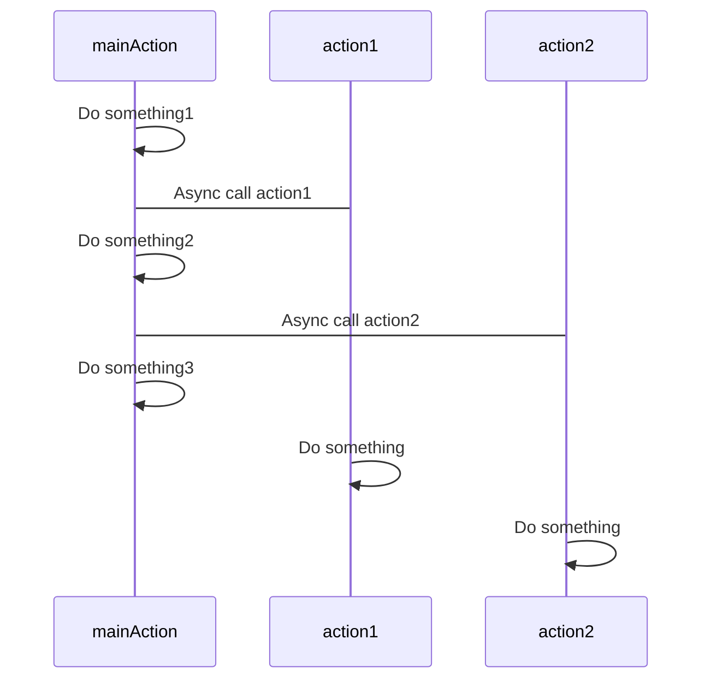
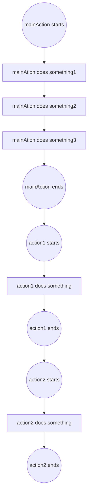
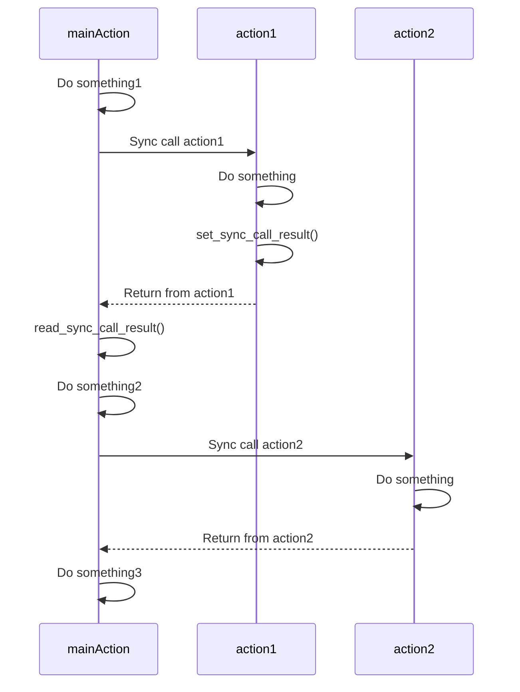
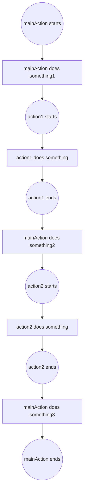

# Sync Calls Design Proposal
Currently an action in a contract cannot call other actions directly. It can only schedule the execution of other actions, using *inline actions*. Inline actions are executed after the calling action finishes its own execution. This mixed mechanism of asynchronous and delayed execution makes it hard to reason with contracts and complicated to build compostable applications.

This document proposes synchronous calls, *sync calls* in short, as an alternative to inline-actions.

The goal is to provide a *familiar* and *simple* way to compose and reason with contracts, without requiring advanced `C++` constructs.

## Inline Actions
An inline action is a dynamically constructed (hence *inline*) action object inside an action, defined by
```c++
action(
   permission_level, // authorization
   code,             // the account where action's contract is deployed
   action,           // the action to be called from this inline action
   data              // the data passed to the action
);
```
`eosio::action` class provides a method `send()` to invoke the inline action. When `send()` is called, the calling action continues its execution without waiting for the inline action. The inline action is scheduled to be run after the calling action finishes its own execution.

Below is an inline action example, where `mainAction` calls inline actions `action1` and `action2`:
```c++
class [[eosio::contract]] contract1 : public eosio::contract {
public:
   [[eosio::action]] void action1() {
      ... // Do something
   }
}
```

```c++
class [[eosio::contract]] contract2 : public eosio::contract {
public:
   [[eosio::action]] void action2() {
      ... // Do something
   }
}
```

```c++
class [[eosio::contract]] mainContract : public eosio::contract {
public:
   [[eosio::action]] void mainAction() {
      ... // Do something1
      eosio::action( permission_level1, "code1"_n, "action1"_n, data1 ).send(); // contract1 was deployed to code1
      ... // Do something2
      eosio::action( permission_level2, "code2"_n, "action2"_n, data2 ).send(); // contract2 was deployed to code2
      ... // Do something3
   }
}
```

The call flow looks like



Time sequence looks like

## Sync Calls
Sync calls are a synchronous mechanism to call other actions. When an action makes a sync call, its execution is suspended and the control is transferred to the called action. After the called action finishes and returns to the calling action, the calling action resumes its execution. This provides a function call mechanism familiar to most developers.

To support sync calls, a new method `call()` is to be added to `eosio::action` class.

A sync call may return results to the calling action. To facilitate this, new host functions `set_sync_call_result()` and `read_sync_call_result()` are provided.

For the example above, we make `action1` return result while keep `action2` the same as the original (does not return result). A sync call version looks like
```c++
class [[eosio::contract]] contract1 : public eosio::contract {
public:
   [[eosio::action]] void action1() {
       ... // Do something
       set_sync_call_result();
   }
}
```

```c++
class [[eosio::contract]] contract2 : public eosio::contract {
public:
   [[eosio::action]] void action2() {
       ... // Do something
   }
}
```

```c++
class [[eosio::contract]] mainContract : public eosio::contract {
public:
   [[eosio::action]] void mainAction() {
      ... // Do something1
      eosio::action( permission_level1, "code1"_n, "action1"_n, data1 ).call(); // action1 returns result
      read_sync_call_result();
      ... // Do something2
      eosio::action( permission_level2, "code2"_n, "action2"_n, data2 ).call(); // action2 does not return result
      ... // Do something3
   }
}
```

Its execution follow is



Time sequence looks like

## Design and Implementation
To support sync calls, the following changes are identified.

### New Host Functions
1. `sync_call()`: make a sync call on the current action. This function is used by `CDT` to implement `call()` method in `eosio::action` class. Contract authors do not use `sync_call()` directly.
```c++
void sync_call(span<const char> action_object);
```
where `action_object` is the serialized form of the action object to be called. `sync_call()` checks authorizations (in the same way as for inline actions), enforces actor white list/blacklist, executes the action and waits for its completion.

2. `set_sync_call_result()`: set the sync call return result.
```c++
void set_sync_call_result(span<const char> packed_result);
```
where
`packed_result` is packed (serialized) return result. The result is stored internally in `transaction_context` for retrieval by `read_sync_call_result()`.

3. `read_sync_call_result()`: read the return result of the latest sync call. It should be used before another sync call, otherwise the return result may be overwritten by new sync calls.
```c++
uint32_t read_sync_call_result(span<const char> memory);
```
where `memory` is a pointer to a buffer. The function copies length bytes of the latest sync call return value to `memory`. If span's size is less than return value's size, an error is raised. Otherwise it returns the number of bytes copied, or number of bytes that are available if an empty span is passed.

### New Protocol Feature `sync_call`
Add a new protocol feature `sync_call` to enable the new host functions.

### EOS VM Runtime
Currently when `eos_vm_runtime` starts executing an action, it assumes the action to be executed from the start to the end without calling another action. Therefore, it is sufficient to use a single EOS-VM `backend` and `execution_ctx`. With sync calls, this assumption does not hold anymore. When a sync call is made, a separate of `backend` and `execution_ctx` are used.

### EOS VM OC Runtime
In the same way as `eos_vm_runtime`, separate `eosvmoc::executor` and `eosvmoc::memory` are used for sync calls.

### `Wasm Allocator`
Currently a single Wasm allocator is used for all action execution, because each action is run through to the end. This needs to be changed so that each sync call uses a different Wasm allocator.

### Transaction Checktime Timer
When a sync call starts, make sure it is guarded by the same transaction checktime timer (not a different one) as other actions in the transaction.

### EOS-VM-JIT and EOS-VM-Interpreter
Thanks to the work of parallel execution of read-only transactions, `EOS-VM-JIT` and `EOS-VM-Interpreter` allow multiple transactions (actions) to be run at the same time. No additional work is required by `EOS-VM-JIT` and `EOS-VM-Interpreter` to support sync calls.

### EOS-VM-OC
No additional work is expected.

### CDT
1. Add support for the new host functions.
2. Add `call()` method to `eosio::action` class. It will be implemented using `sync_call()` host function.

## Tests
Unit and integration tests will be added, covering
* basic tests
* sync call actions in the same and different contracts
* return results and no return results
* various sync call depths
* infinite recursive sync calls
* authorization checks

## Usage Considerations
1. Re-entrance: A sync call may modify global state. In the same way as using any functions, contract authors must be careful about function re-entrance and are responsible for making sure any usage of state is consistent before and after a sync call.
2. Authorization: Authorization for sync calls is the same as for inline actions.
3. Failures: If a sync call fails for any reasons, the parent transaction fails.

## Open Questions
1. Initial implementation uses separate backends and execution contexts for EOS-VM-JIT and EOS-VM-Interpreter, and executors and memories for EOS-VM-OC. Later, investigate whether or not a single copy is possible to be reused for sync calls.
2. Should we introduce `max_sync_call_action_depth`, in the same way as `max_inline_action_depth`?
3. Should we limit the size of return value?
